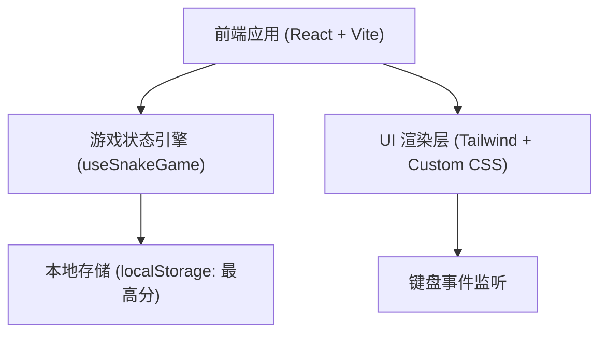

## 1. 架构设计

## 2. 技术说明
- 前端框架：React@18
- 样式方案：tailwindcss@3 搭配自定义 CSS 发光滤镜（box-shadow/text-shadow）
- 构建工具：vite

## 3. 路由定义
单页面应用，仅一个主路由。
| 路由 | 用途 |
|------|------|
| / | 游戏主页面，包含所有逻辑和 UI |

## 4. 核心数据结构与状态
- `GRID_SIZE`: 网格尺寸常量（如 20x20）。
- `snake`: 数组类型，存储蛇身每个节点的坐标 `[{x, y}, ...]`。
- `food`: 对象类型，当前食物的坐标 `{x, y}`。
- `direction`: 对象类型，当前移动方向 `{x, y}`。
- `score`: 整数，当前分数。
- `highScore`: 整数，最高分数。
- `isGameOver`: 布尔值，标识游戏是否结束。
- `isPaused`: 布尔值，标识游戏是否处于未开始/暂停状态。

## 5. 核心逻辑处理
- **游戏循环**：使用 `useEffect` 和 `setInterval`（或 `requestAnimationFrame`）根据固定时间间隔（如 150ms）触发状态更新。
- **碰撞检测**：在每次移动计算后，检查新蛇头坐标是否超出 `0` 到 `GRID_SIZE-1` 的范围，或是否在 `snake` 数组中。
- **输入防抖/节流**：防止在单个滴答周期内快速按两次方向键导致反向移动死亡的问题（通过记录 `lastRenderedDirection` 实现）。
