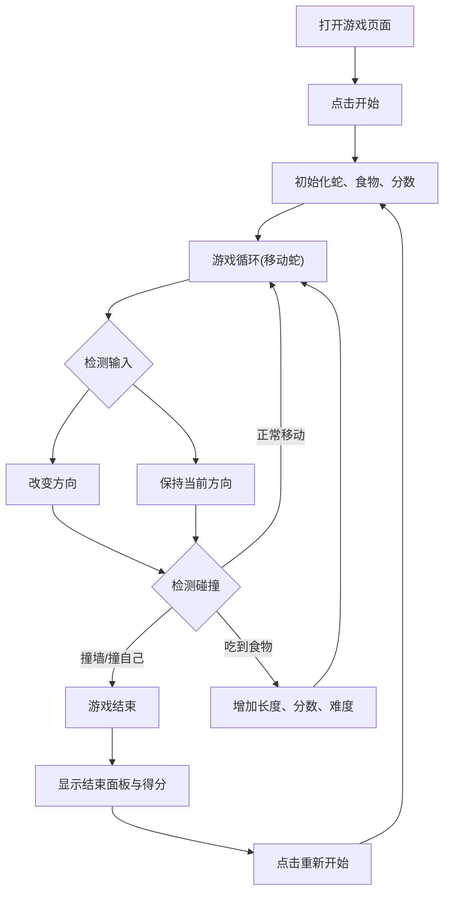

## 1. 产品概述
网页版经典贪吃蛇游戏。
- 通过现代化的网页技术重新演绎经典街机游戏，提供流畅的控制体验和引人注目的视觉效果。
- 旨在为用户带来简单直接但极具挑战性的休闲娱乐，结合现代极简主义与赛博发光美学。

## 2. 核心功能

### 2.1 用户角色
| 角色 | 注册方式 | 核心权限 |
|------|---------------------|------------------|
| 玩家 | 无需注册 | 游玩游戏，查看当前得分与最高分 |

### 2.2 功能模块
1. **游戏主界面**：包含居中的游戏网格区域、实时分数板、最高分记录。
2. **控制与状态面板**：开始/暂停游戏按钮、游戏结束提示遮罩层。

### 2.3 页面详情
| 页面名称 | 模块名称 | 功能描述 |
|-----------|-------------|---------------------|
| 主界面 | 状态栏 | 显示当前分数（Score）与历史最高分（High Score）。 |
| 主界面 | 游戏网格 | 渲染蛇身与食物，处理碰撞与运动逻辑。 |
| 主界面 | 游戏控制 | 处理键盘事件（方向键/WASD）与移动端滑动事件。 |
| 主界面 | 结束弹窗 | 游戏结束时显示最终得分，并提供重新开始的按钮。 |

## 3. 核心流程

## 4. 用户界面设计
### 4.1 设计风格
- 主色调与背景：深邃的黑灰色背景（#0F1115），带有微妙的噪点纹理或 CRT 扫描线效果，营造沉浸式复古街机感。
- 强调色：
  - 蛇身：明亮的霓虹绿（#39FF14），蛇头颜色略深或带有高光，整体具有轻微的发光效果。
  - 食物：闪烁的荧光粉色（#FF0055），带有呼吸灯动画效果。
- 字体与排版：使用像素风格字体或现代无衬线粗体，用于分数和状态显示。
- 布局风格：极简居中卡片式布局，游戏区域有明显的发光边框。
- 动画与微交互：食物生成时的弹出动画，游戏结束时的屏幕微震或特效。

### 4.2 页面设计总览
| 页面名称 | 模块名称 | UI 元素 |
|-----------|-------------|-------------|
| 主界面 | 分数板 | 大号发光字体，并排显示 Score 和 Best。 |
| 主界面 | 游戏区域 | N x N 网格（不显示线，逻辑网格），带圆角方块组成的蛇身，带光晕圆点食物。 |
| 主界面 | 控制提示 | 底部淡灰色小字提示："Press W/A/S/D or Arrow Keys to Move"。 |

### 4.3 响应式设计
桌面端优先，通过键盘控制。在移动端（宽度小于 768px）时，自动缩放游戏网格，并引入全局触摸滑动事件（Swipe）替代键盘控制，确保手机良好游玩体验。