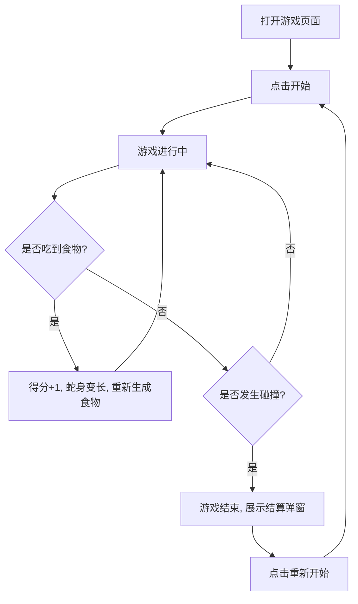

## 1. 产品概述
网页版经典贪吃蛇游戏。
- 主要提供一个基于网页环境运行的、富有设计感和现代审美的贪吃蛇游戏体验。
- 作为休闲娱乐和小游戏的经典复刻，带给用户有趣、流畅的交互体验。

## 2. 核心功能

### 2.1 用户角色
| 角色 | 注册方式 | 核心权限 |
|------|---------------------|------------------|
| 玩家 | 免注册 | 体验贪吃蛇游戏、记录本地最高分 |

### 2.2 功能模块
1. **游戏主界面**：游戏画布、分数显示、最高分记录、开始/暂停/重置按钮、控制方向按键（移动端适配）。
2. **结算模块**：游戏结束提示（Game Over）、最终得分展示、重新开始按钮。

### 2.3 页面详情
| 页面名称 | 模块名称 | 功能描述 |
|-----------|-------------|---------------------|
| 游戏页 | 状态栏 | 显示当前分数、历史最高分、当前游戏状态（运行中/暂停/结束） |
| 游戏页 | 游戏区 | 贪吃蛇移动、食物随机生成、碰撞检测（墙壁/自身） |
| 游戏页 | 控制区 | 键盘方向键控制（PC端）或屏幕方向虚拟按键（移动端适配） |
| 游戏页 | 结算弹窗 | 碰撞失败后展示得分，并提供重新开始选项 |

## 3. 核心流程
玩家打开页面 -> 点击“开始游戏” -> 贪吃蛇初始移动 -> 玩家通过方向键控制蛇的移动方向 -> 蛇吃到食物得分增加、身体变长 -> 蛇撞墙或撞到自己导致游戏结束 -> 弹出结算界面 -> 点击“重新开始”回到初始状态。

## 4. 用户界面设计
### 4.1 设计风格
- 主色调和次色调：采用现代、复古赛博朋克（Cyberpunk）风格，或极简霓虹（Neon）风格。背景为深色（#111111），贪吃蛇为亮绿色发光材质，食物为亮红色/粉色发光点。
- 按钮风格：圆角按钮，带有发光边框或发光阴影效果（Neon Glow），Hover时亮度增加。
- 字体：使用具有科幻感或像素风（Pixel/Monospace）的无衬线字体。
- 布局风格：居中卡片式布局，游戏区在正中，状态栏在上方。

### 4.2 页面设计概览
| 页面名称 | 模块名称 | UI 元素 |
|-----------|-------------|-------------|
| 游戏页 | 整体 | 黑色背景，中心发光网格画布 |
| 游戏页 | 状态栏 | 像素风字体，绿色显示分数，霓虹发光效果 |
| 游戏页 | 游戏画布 | 带有网格暗纹的深色底板，发光方块代表蛇身与食物 |

### 4.3 响应式
桌面端优先，同时适配移动端（提供屏幕下方的方向控制虚拟按键操作支持）。
