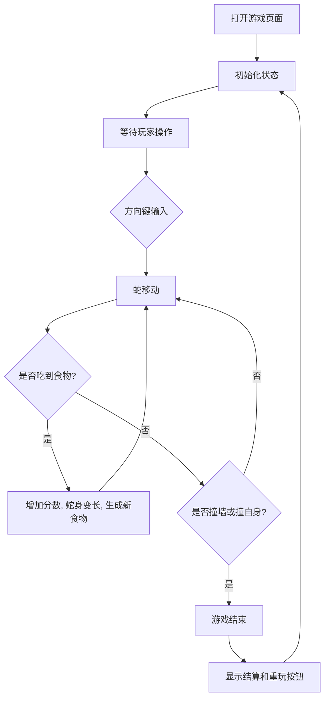

## 1. 产品概述
使用 React 和 Tailwind CSS 构建的现代化、极具设计感的网页版“贪吃蛇”游戏。
- 主要解决在浏览器中提供高质量休闲娱乐体验的需求。
- 目标受众：喜爱复古街机游戏并欣赏现代 UI 设计的玩家。
- 采用赛博朋克（Cyberpunk）霓虹灯风格，打破传统简陋的像素风，提供令人难忘的视觉体验。

## 2. 核心功能

### 2.1 用户角色
无角色区分，所有玩家直接打开即玩。

### 2.2 功能模块
1. **主页面**：游戏网格区域、分数面板、控制提示、游戏结束弹窗。

### 2.3 页面详情
| 页面名称 | 模块名称 | 功能描述 |
|----------|----------|----------|
| 游戏主页 | 状态面板 | 显示当前分数、最高分数（本地存储记录） |
| 游戏主页 | 游戏网格 | 渲染发光的蛇身、食物，处理核心游戏逻辑 |
| 游戏主页 | 控制层   | 监听键盘方向键或 WASD 输入 |
| 游戏主页 | 结算层   | 游戏结束时弹出，展示得分并提供重新开始按钮 |

## 3. 核心流程
玩家打开页面 -> 游戏默认准备就绪 -> 玩家按下方向键开始移动 -> 吃到发光食物得分并变长 -> 撞击边界或自身导致游戏结束 -> 弹出霓虹风格结算界面。

## 4. 用户界面设计
### 4.1 设计风格
- 主色调：深色背景（极黑 `#0a0a0a`），搭配高饱和度的霓虹发光色（蛇身为霓虹绿 `#39ff14`，食物为赛博紫 `#b026ff` 或激光蓝 `#00f3ff`）。
- 按钮风格：无背景但带有强烈的发光边框，悬停时产生明显的色彩填充或亮度提升。
- 字体：使用具有未来感或街机感的无衬线等宽字体（Monospace）。
- 布局：居中网格对齐，极简、突出重点。
- 动效：食物带有 CSS 脉冲（Pulse）呼吸发光效果，蛇移动时视觉平滑。

### 4.2 页面设计概述
| 页面名称 | 模块名称 | UI 元素 |
|----------|----------|---------|
| 游戏主页 | 全局     | 深色纯净背景，霓虹光晕效果，居中布局 |
| 游戏主页 | 网格区域 | 隐约可见的暗色网格线，凸显科幻感 |

### 4.3 响应式设计
桌面端优先，确保在桌面浏览器中有最佳的键盘操作体验和视觉效果。
