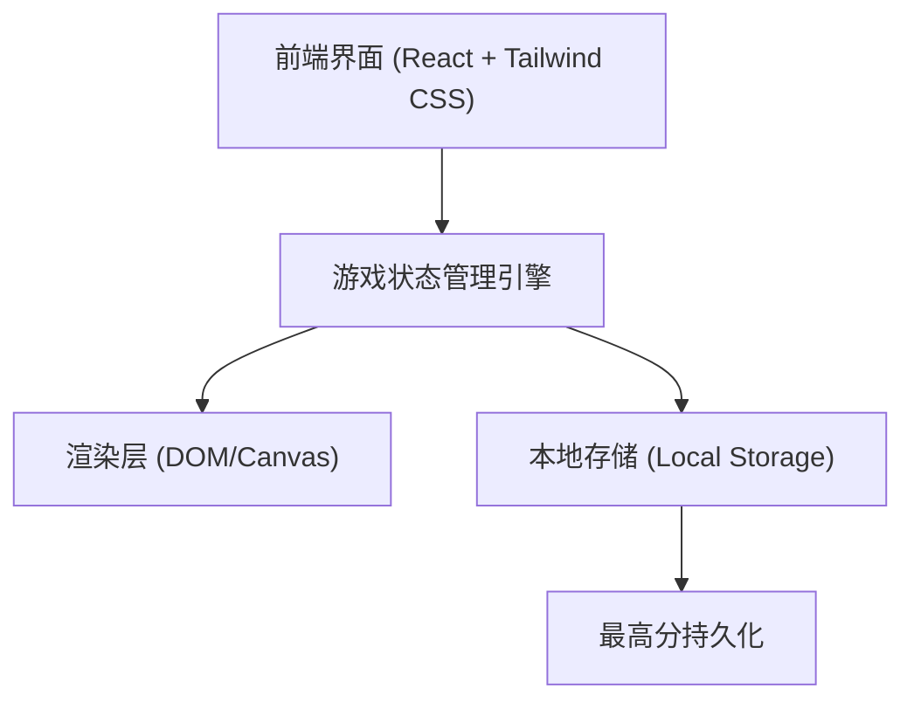

## 1. 架构设计

## 2. 技术说明
- 前端框架：React@18 + tailwindcss@3 + vite
- 图标库：lucide-react
- 游戏核心：React State (`useState`, `useCallback`, `useEffect`) 配合 `setInterval` 或 `requestAnimationFrame` 进行游戏主循环（Game Loop）。
- 样式和动画：Tailwind CSS，利用自定义类或 style 提供霓虹发光效果（如 `box-shadow`）。
- 存储：浏览器的 `localStorage` 记录 `snake_high_score`。

## 3. 路由定义
| 路由 | 用途 |
|-------|---------|
| / | 游戏主页面，包含完整的画布、UI与游戏逻辑 |

## 4. 数据模型设计 (Data Model)
游戏核心状态包含以下字段，用于 React 组件内管理：
- `snake`: `Array<{x: number, y: number}>` - 蛇的身体坐标集合，数组第一个元素为蛇头。
- `food`: `{x: number, y: number}` - 当前生成的食物坐标。
- `direction`: `{x: number, y: number}` - 当前移动方向矢量 (如 UP={x:0, y:-1}, DOWN={x:0, y:1}, LEFT={x:-1, y:0}, RIGHT={x:1, y:0})。
- `status`: `string` - 游戏状态，可选值：`IDLE` (未开始), `PLAYING` (进行中), `PAUSED` (暂停), `GAME_OVER` (结束)。
- `score`: `number` - 当前得分。
- `highScore`: `number` - 历史最高分，初始化时从 localStorage 读取。

## 5. 核心逻辑实现简述
1. **游戏循环**：在 `useEffect` 中设置 `setInterval`，间隔随分数增加适当缩小（加速难度）。每次间隔触发 `moveSnake` 方法。
2. **移动逻辑**：计算新的蛇头位置（当前蛇头坐标 + 方向矢量），将其放入 `snake` 数组开头。如果未吃到食物，移除数组末尾（蛇尾）；如果吃到食物，保留蛇尾，更新分数，并重新生成不与蛇身重叠的食物。
3. **碰撞检测**：新蛇头超出网格边界，或者新蛇头坐标与当前 `snake` 数组中的任一坐标重叠，则判定为游戏结束，更新状态为 `GAME_OVER`。
4. **控制输入**：监听 `keydown` 事件。阻止反向移动（例如当前向右时，按向左无效）。
