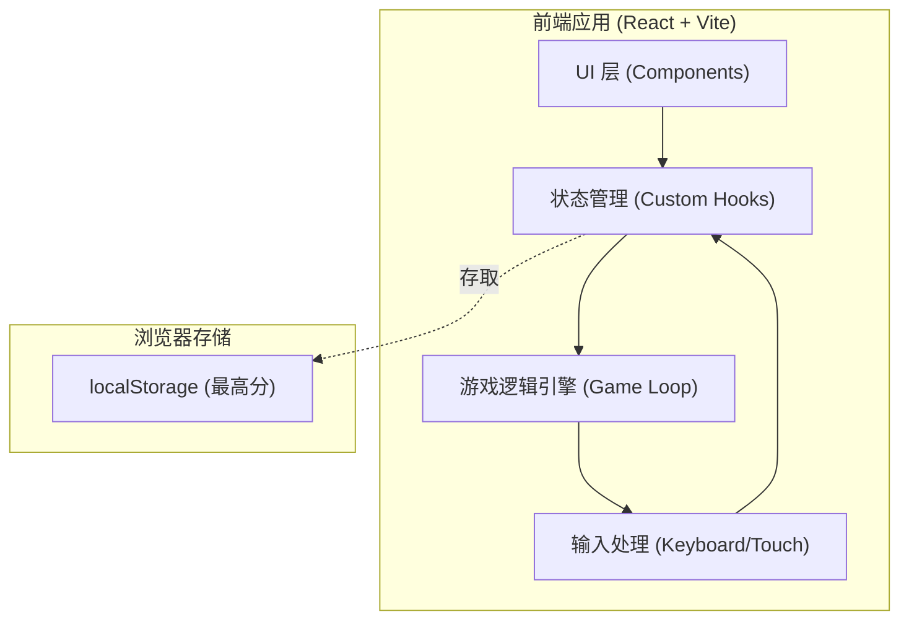

## 1. 架构设计

## 2. 技术说明
- **前端框架**: React@18
- **样式方案**: Tailwind CSS@3 + CSS Modules/纯 CSS（用于复杂发光和动画）
- **构建工具**: Vite
- **图标与字体**: Lucide React（图标），Google Fonts
- **状态管理**: React Hooks (`useState`, `useEffect`, `useRef`, `useCallback`)
- **游戏循环**: 基于自定义 `useInterval` hook 实现的精确计时循环。

## 3. 路由定义
| 路由 | 目的 |
|-------|---------|
| / | 游戏主页面（单页面应用，无其他路由） |

## 4. 核心组件设计
- **`App`**: 根组件，提供整体布局和背景样式。
- **`GameBoard`**: 渲染游戏网格、蛇身块和食物。
- **`ScoreBoard`**: 顶部计分板组件。
- **`GameOverOverlay`**: 游戏结束时的覆盖层，包含最终得分和重玩按钮。

## 5. 核心状态与数据模型
- **`snake`**: `Array<{x: number, y: number}>` - 记录蛇身坐标。
- **`food`**: `{x: number, y: number}` - 当前食物坐标。
- **`direction`**: `{x: number, y: number}` - 当前移动向量（如 `{x: 0, y: -1}` 为上）。
- **`gameOver`**: `boolean` - 游戏是否结束。
- **`isPaused`**: `boolean` - 游戏是否暂停。
- **`score`**: `number` - 当前分数。
- **`highScore`**: `number` - 历史最高分（同步到 localStorage）。
- **`speed`**: `number` - 游戏循环的时间间隔（ms），随分数增加减小提升难度。