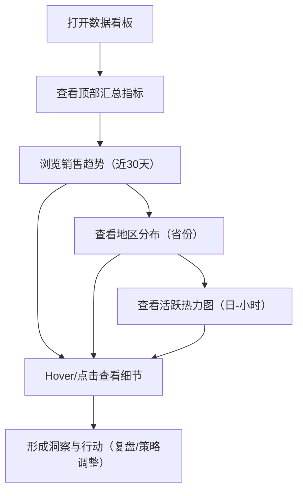

## 1. Product Overview
面向业务与运营的网页数据看板，用于快速掌握销售趋势、地区结构与用户活跃规律。
- 解决问题：分散数据难以对比与发现异常；需要一屏概览与可交互的洞察入口
- 目标用户：运营、销售负责人、数据分析师、管理层

## 2. Core Features

### 2.1 Feature Module
1. **数据看板页**：顶部汇总指标、销售趋势折线图（近30天）、地区分布饼图（省份）、用户活跃度热力图（日-小时）、全局交互与状态反馈

### 2.2 Page Details
| Page Name | Module Name | Feature description |
|-----------|-------------|---------------------|
| 数据看板 | 顶部汇总指标 | 展示用户数、转化率、日均收入；支持同比/环比占位与趋势标识（可选） |
| 数据看板 | 销售趋势折线图 | 默认展示近30天销售额/订单量（可切换指标）；支持 hover tooltip、缩放/平移（可选）、高亮周末/异常点（可选） |
| 数据看板 | 地区分布饼图 | 按省份展示销售贡献或用户占比；支持图例开关、点击扇区过滤联动（可选） |
| 数据看板 | 用户活跃度热力图 | 展示周一到周日 × 0-23 时段的活跃强度；支持 hover 显示具体数值、色阶图例 |
| 数据看板 | 统一交互与状态 | 统一 Loading/Empty/Error 样式；支持浅色/深色主题（默认深色）；自适应布局与卡片风格一致 |

## 3. Core Process
用户打开数据看板，先浏览顶部关键指标，再通过趋势、结构、规律三类图表进行对比与定位问题；必要时通过交互查看详情并导出截图（可选）。

## 4. User Interface Design
### 4.1 Design Style
- 视觉基调：深色石墨底 + 高对比冷白文本 + 酸橙/青色点缀
- 卡片风格：圆角 14–16px、低饱和阴影、细边框（半透明）、内边距充足
- 字体：标题使用具有个性的展示字体（可从 Google Fonts 选择），正文使用易读的无衬线字体
- 布局：顶部指标 3 卡并排；下方 2×2 网格卡片，自适应断点在窄屏改为单列
- 动效：首屏淡入与轻微上浮；hover 时卡片边框与阴影增强；图表 tooltip 风格统一

### 4.2 Page Design Overview
| Page Name | Module Name | UI Elements |
|-----------|-------------|-------------|
| 数据看板 | 顶部汇总指标 | 3 张指标卡：大数值、单位、微型趋势（可选）、说明文本 |
| 数据看板 | 销售趋势卡片 | 卡片标题+副标题（近30天），折线图，图例/指标切换（可选） |
| 数据看板 | 地区分布卡片 | 饼图+图例列表，省份Top展示，颜色与主题匹配 |
| 数据看板 | 活跃热力卡片 | 热力图网格，左侧/顶部轴标签，色阶说明与tooltip |

### 4.3 Responsiveness
桌面优先，≥1024px 采用 12 栅格；768–1023px 为 2 列；<768px 单列，图表保持可读性并支持横向滚动（必要时）。
