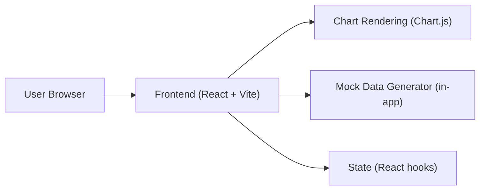
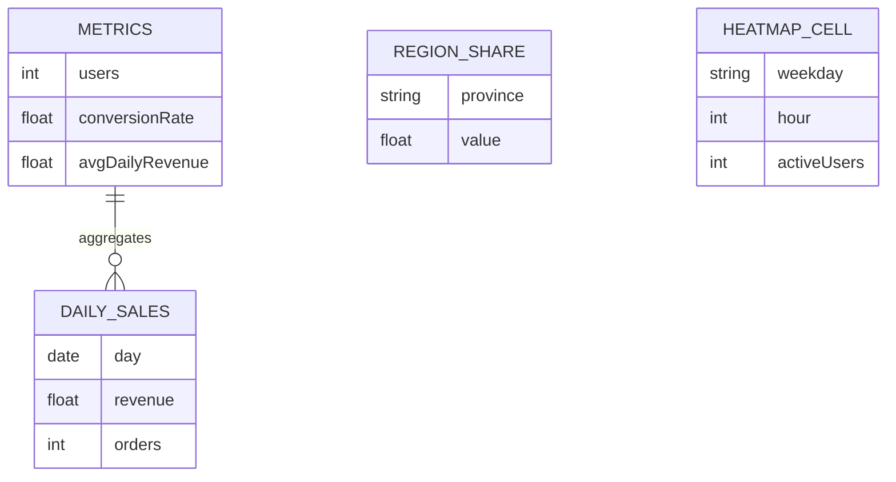

## 1. Architecture Design

## 2. Technology Description
- Frontend: React@18 + TypeScript + Vite
- Styling: tailwindcss@3（或 CSS Modules，二选一，以统一卡片风格为主）
- Charts: Chart.js + react-chartjs-2
- Data: 纯前端 mock 数据（近30天趋势、按省份分布、周×小时热力矩阵）
- Backend: None
- Initialization Tool: Vite（create-vite）

## 3. Route Definitions
| Route | Purpose |
|-------|---------|
| / | 数据看板单页入口 |

## 4. API Definitions (if backend exists)
无（纯前端 mock 数据）。

## 5. Server Architecture Diagram (if backend exists)
无。

## 6. Data Model (if applicable)
### 6.1 Data Model Definition

### 6.2 Data Definition Language
无（不落库）。
