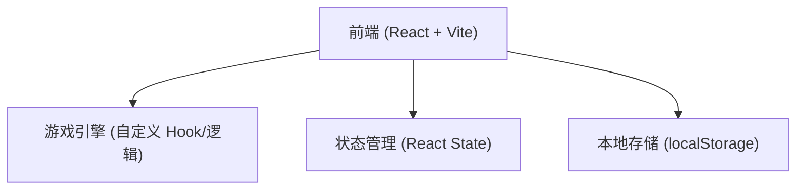

## 1. 架构设计

## 2. 技术说明
- 前端框架: React@18 + tailwindcss@3 + vite
- 初始化工具: vite-init
- 样式方案: Tailwind CSS 结合自定义 CSS Variables（用于霓虹发光等高级特效）
- 动画与交互: Framer Motion (用于界面过渡和得分弹跳动效) 以及自定义 CSS keyframes
- 游戏渲染: DOM Grid / 响应式布局配合 Tailwind CSS

## 3. 路由定义
单页面应用，采用组件状态切换而非真实的URL路由。
| 状态/页面组件 | 用途 |
|-------|---------|
| `Menu` | 游戏主菜单与开始界面 |
| `GameCanvas` | 游戏进行中界面 |
| `GameOver` | 游戏结束结算界面 |

## 4. API定义
无后端服务。纯前端本地运行。

## 5. 数据模型
- 蛇的数据结构：坐标数组 `[{x: number, y: number}, ...]`
- 食物坐标：`{x: number, y: number}`
- 方向枚举：`UP`, `DOWN`, `LEFT`, `RIGHT`
- 游戏状态：`IDLE`, `PLAYING`, `GAMEOVER`
- 游戏数据存储：
  - `currentScore` (number): 当前得分
  - `highScore` (number): 历史最高分，存储于 `localStorage`
- 游戏配置：
  - 网格尺寸 (e.g. 20x20)
  - 基础速度 (e.g. 150ms 移动一格)
