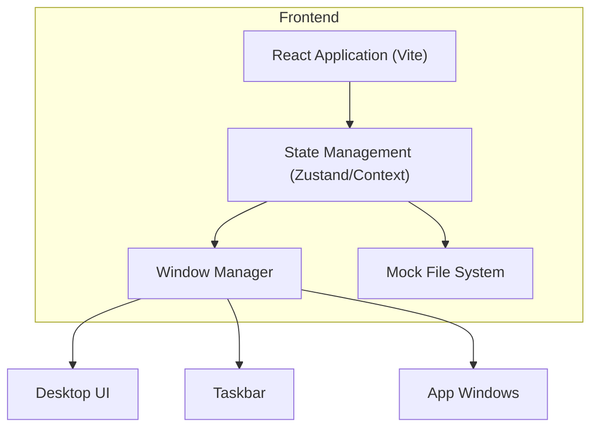

## 1. Architecture Design



## 2. Technology Description
- **Frontend Framework**: React@18
- **Build Tool**: Vite
- **Styling**: Tailwind CSS@3
- **State Management**: Zustand (recommended for complex window/file state)
- **Animation**: Framer Motion (for smooth window interactions)
- **Drag/Resize**: react-rnd or custom implementation

## 3. Application Structure
| Component | Purpose |
|-------|---------|
| `App.tsx` | Root component, providers setup |
| `Desktop.tsx` | Main workspace area |
| `Taskbar.tsx` | Bottom panel with start menu |
| `WindowManager.tsx` | Manages window instances and z-indexes |
| `apps/*` | Individual application components (Terminal, Explorer, etc.) |

## 4. State Models

### Window State
```typescript
interface WindowState {
  id: string;
  appId: string;
  title: string;
  isMinimized: boolean;
  isMaximized: boolean;
  isFocused: boolean;
  position: { x: number, y: number };
  size: { width: number, height: number };
  zIndex: number;
}
```

### Mock File System State
```typescript
interface FileSystemNode {
  id: string;
  name: string;
  type: 'file' | 'directory';
  content?: string;
  parentId: string | null;
}
```
