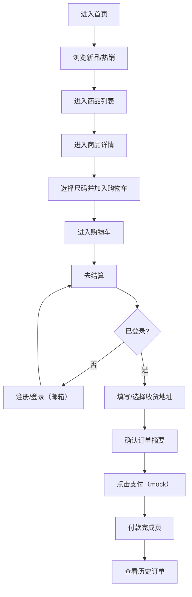

## 1. Product Overview
面向中国消费者的女装电商网站，整体风格参考 Zara / H&M：简洁现代、强调大图与编辑感信息排版，并对移动端浏览做重点适配。目标是完成从浏览-加购-结算-支付（mock）-查看订单的闭环，并提供邮件联系官方入口。

## 2. Core Features

### 2.1 User Roles
| Role | Registration Method | Core Permissions |
|------|---------------------|------------------|
| 普通用户 | 邮箱注册/登录 | 浏览商品、收藏/加购、下单结算、查看订单、评价浏览 |

### 2.2 Feature Module
1. **首页**：顶部导航、轮播图、类目入口、新品推荐、热销商品、新用户弹窗（仅首次访问触发）、页脚联系信息
2. **注册/登录页**：邮箱注册、邮箱登录、基础表单校验、登录态保持（本地）
3. **商品列表页**：筛选/排序（基础）、商品卡片瀑布/网格、分页或“加载更多”
4. **商品详情页**：商品大图/图集、价格与关键信息、尺码信息、加购、用户评价列表
5. **购物车**：数量调整、删除、价格汇总、去结算
6. **下单结算**：收货地址填写与保存、订单摘要、选择支付方式（mock）、提交订单
7. **支付结果页（mock）**：点击“支付”即完成付款，展示成功状态与订单号
8. **历史订单页**：订单列表、订单详情（含地址、商品、金额、状态）
9. **联系我们**：通过邮件方式联系官方（mailto 链接 + 可选表单生成邮件内容）
10. **敬请期待空状态**：尚未实现/未上线功能入口统一显示“敬请期待”

### 2.3 Page Details
| Page Name | Module Name | Feature description |
|-----------|-------------|---------------------|
| 首页 | 轮播图 | 3–5 张主视觉，自动轮播+手动切换，支持触控滑动，悬停暂停（桌面端） |
| 首页 | 新品推荐 | 基于 mock 商品数据的“New In”区块，支持跳转详情 |
| 首页 | 热销商品 | 基于 mock 销量字段排序展示 |
| 首页 | 新用户弹窗 | 首次访问展示 1 次（本地标记），可关闭；内容为新人优惠提示或订阅提示（不收集短信） |
| 注册/登录 | 邮箱注册 | 邮箱格式校验、密码强度提示、注册后自动登录 |
| 注册/登录 | 邮箱登录 | 邮箱+密码校验；错误提示明确但不泄露账户存在性（前端 mock 仍保持一致文案） |
| 商品列表 | 筛选/排序 | 类目、价格区间、颜色（可选）、排序（新品/价格/热销） |
| 商品详情 | 图集 | 大图优先，缩略图/滑动图集，支持放大查看（轻量） |
| 商品详情 | 尺码信息 | 尺码表与建议提示；尺码选择必选后可加购 |
| 商品详情 | 用户评价 | 展示评分、标签、评论内容与时间；仅浏览（初期不做发布） |
| 购物车 | 价格计算 | 小计、运费规则（mock，可固定或满额包邮）、总计实时更新 |
| 结算 | 收货地址 | 收件人、手机号、中国地址（省市区/详细地址）基础校验；保存到本地以便复用 |
| 支付 | Mock 支付 | 点击“立即支付”直接进入成功页并更新订单状态为已支付 |
| 历史订单 | 订单列表 | 展示订单号、时间、状态、金额；可进入订单详情 |
| 联系我们 | 邮件联系 | 固定官方邮箱 + 可预填主题与正文（订单号等） |

## 3. Core Process
用户主流程：
1) 访客浏览首页与列表 → 进入详情 → 选择尺码加购 → 进入购物车 → 登录/注册 → 结算填写地址 → mock 支付完成 → 在历史订单中查看订单。

Mermaid 流程图：

## 4. User Interface Design

### 4.1 Design Style
- 主色：黑/白/灰（高对比但避免刺眼纯黑大面积铺底）
- 点缀色：柔和米色（暖）与深蓝（冷）择一为主，另一作为二级点缀；用于按钮主态、标签与链接高亮
- 版式：大图优先、编辑排版（杂志感留白）、信息层级清晰；列表以网格为主
- 按钮：矩形为主，轻微圆角（2–6px），hover/pressed 通过透明度与位移体现
- 字体：选择一款具有“时装编辑感”的展示字体用于标题（可变字重更佳），正文选择易读的无衬线；中英混排注意字距与行高
- Icon：统一线性图标（购物袋、搜索、用户、心愿单、返回、关闭等），不使用 emoji
- 动效：克制、顺滑；页面进入淡入/上移、轮播切换、加购与数量调整的微动效

### 4.2 Page Design Overview
| Page Name | Module Name | UI Elements |
|-----------|-------------|-------------|
| 首页 | 顶部导航 | 极简顶栏：Logo 左、导航中、功能图标右；滚动时压缩高度 |
| 首页 | 轮播主视觉 | 全宽大图 + 低对比文字叠层；指示器细线/数字分页风格 |
| 首页 | 新品/热销 | 两段编辑区块：标题、描述、CTA；商品卡片强调面料与剪裁文案 |
| 注册/登录 | 表单 | 极简表单 + 明确错误提示；提交按钮强对比点缀色 |
| 列表 | 商品网格 | 2–4 列自适应；图片比例统一，hover 轻微放大与阴影 |
| 详情 | 图集+购买区 | 左图右信息（桌面）；移动端改为上图下信息，购买按钮固定底部 |
| 购物车 | 列表+汇总 | 条目清晰，数量步进器一致风格；结算按钮明显 |
| 结算 | 地址+摘要 | 分区卡片化，但保持边框克制；关键金额加粗 |
| 订单 | 列表 | 状态标签低饱和；支持查看详情 |
| 联系我们 | 邮件入口 | 直接邮件按钮 + 常见问题占位（未上线则“敬请期待”） |

### 4.3 Responsiveness
- 桌面优先布局，同时对移动端做触控与拇指区优化（底部固定 CTA、卡片间距增大）
- 列表在 375px 以 2 列为主，>768px 逐步提升到 3–4 列
- 图片优先加载与骨架屏（轻量），避免移动端首屏抖动

