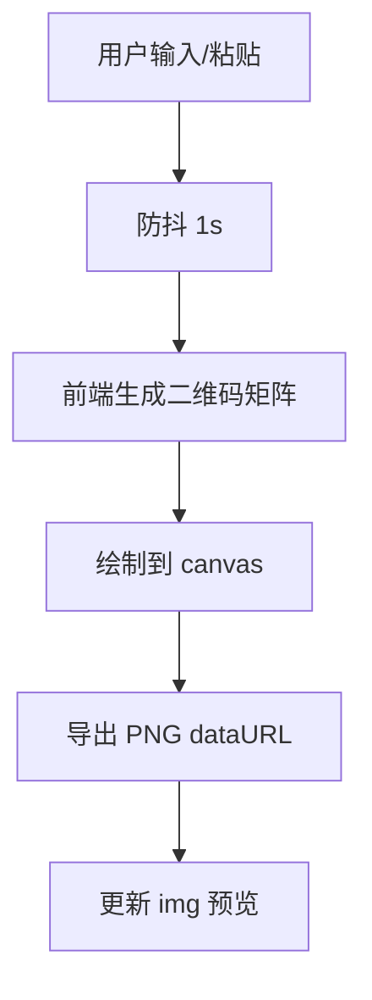

# PRD：极简在线二维码生成工具

## 1. 背景与目标

用户希望在任意设备上快速将“网址或文本”转换为可扫描的二维码，并可直接右键保存图片。该工具应做到：

- 无需注册/登录
- 无需安装（纯 Web）
- 极简界面、快速加载、即时生成
- 不收集、不存储用户输入内容

## 2. 用户画像与使用场景

- 临时分享链接：会议、活动海报、课堂资料、社群分享
- 文本信息分享：Wi-Fi 提示、地址、短句、邀请码
- 移动端扫码：桌面生成 → 手机扫码

## 3. 核心体验原则

- 一次打开即可用：默认聚焦输入框，粘贴后立刻出结果
- 零干扰：不出现复杂设置、广告式模块、注册引导
- 清晰可扫：二维码尺寸充足、对比度高、容错级别合理
- 直接保存：二维码以图片方式渲染，用户可右键“另存为”

## 4. 功能需求（Must）

### 4.1 输入框

- 提供一个大尺寸、多行文本输入框（textarea）
- 占位提示语：粘贴你的网址或文本链接
- 支持：
  - HTTP / HTTPS 链接
  - 任意纯文本（包含中文、空格、换行）
- 输入长度：
  - 软限制：给出剩余/超限提示（不阻塞输入）
  - 超过可编码范围时，提示“内容过长，建议缩短”，并不生成二维码

### 4.2 即时生成（无按钮）

- 用户输入或粘贴后自动生成二维码
- 触发策略：
  - 防抖：用户停止输入 1 秒后生成
  - 粘贴事件：粘贴后立即尝试生成（可仍走防抖但缩短到 0–200ms）
- 状态展示：
  - 空输入：显示占位示意（例如“等待输入内容”）
  - 生成中：短暂的 loading（仅在必要时出现）
  - 失败：显示明确错误信息（长度过长、无法编码等）

### 4.3 二维码显示

- 在输入框下方（移动端）或右侧（桌面端）展示二维码
- 二维码应为图片元素（img），来源为前端生成的 PNG dataURL 或 Blob URL
- 清晰度要求：
  - 默认尺寸：至少 256×256（桌面推荐 320–384）
  - 放大显示不糊（使用 canvas 按像素倍数绘制）
  - 保持足够留白（quiet zone）
- 建议参数：
  - 纠错级别：M（默认）或 Q（在可行时）

### 4.4 保存功能

- 用户可对二维码图片右键“保存图片”
- 生成图片格式优先 PNG
- 允许点击图片触发下载（Nice to have，可选；不影响右键保存）

## 5. 非功能需求

### 5.1 性能

- 首屏加载小而快：无后端请求或仅加载静态资源
- 生成过程在主线程可接受（对超长文本主动提示避免卡顿）
- 输入时不频繁重绘（防抖）

### 5.2 响应式与可访问性

- 桌面/平板/手机均可用
- 键盘可操作：Tab 聚焦输入框；错误提示可读
- 颜色对比度满足基本可读性

### 5.3 安全与隐私

- 不将输入内容上传到任何服务器
- 不持久化存储输入（不写入 localStorage / cookie）
- 不在控制台输出用户输入内容
- 防止 XSS：
  - 不使用 innerHTML 渲染用户输入
  - 文本仅作为二维码编码源

## 6. 交互与页面结构（建议）

信息架构：

- 顶部：工具标题 + 一句说明（例如“粘贴内容，即时生成二维码”）
- 主区：
  - 左：输入框
  - 右：二维码预览（含状态/错误）
- 页脚：隐私声明（“不上传、不保存”）与开源许可（如适用）

## 7. 埋点与数据（明确不做）

- 不做登录、用户体系
- 不做服务端存储、历史记录
- 不做输入内容分析/上传

## 8. 验收标准

- 打开页面无需注册即可输入内容
- 输入或粘贴后 1 秒内生成二维码（粘贴更快）
- 二维码可被常见扫码工具识别（微信/相机/浏览器扫码）
- 对二维码图片右键可保存为 PNG
- 在手机端布局不拥挤、可滚动、可操作

