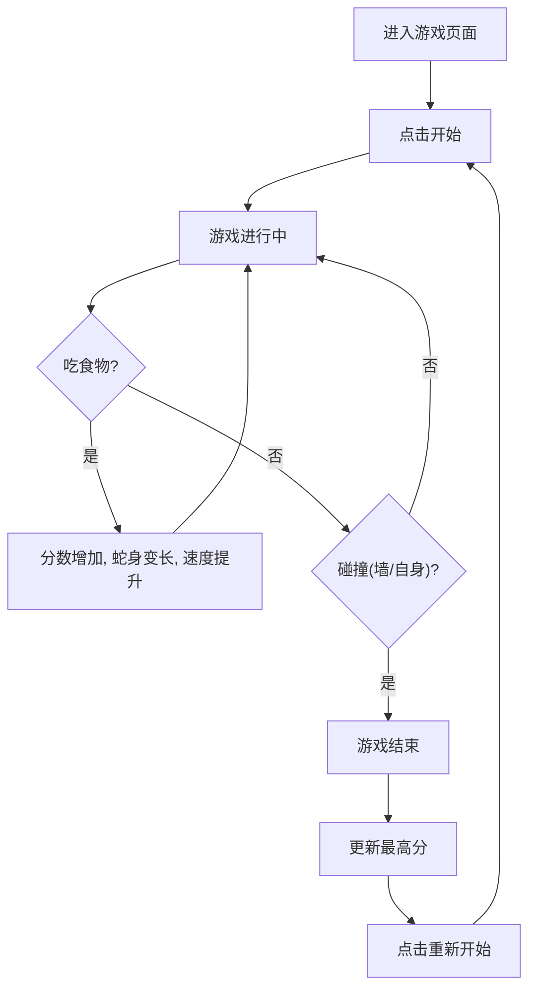

## 1. 产品概述
一个具有复古未来主义（Retro-Futuristic/赛博朋克霓虹）视觉风格的现代网页版贪吃蛇游戏。
- 核心目标是提供一个视觉表现极佳、操作流畅的经典贪吃蛇体验，避免平庸的设计。
- 目标用户：喜欢复古街机游戏和现代高品质网页设计的玩家。

## 2. 核心功能

### 2.1 功能模块
1. **游戏主页**：霓虹风格的标题区、游戏主画布区、当前分数与最高分显示区、控制说明区。
2. **状态与交互面板**：展示游戏状态（开始、暂停、结束），并提供霓虹发光按钮操作。

### 2.2 页面详细信息
| 页面名称 | 模块名称 | 功能描述 |
|-----------|-------------|---------------------|
| 游戏主页 | 游戏画布 | 渲染网格、蛇身（带发光效果）、食物。处理碰撞检测与移动逻辑。 |
| 游戏主页 | 计分板 | 实时更新当前分数，记录并展示本地最高分。 |
| 游戏主页 | 控制面板 | 提供开始/暂停控制，以及键盘/触控操作提示。 |

## 3. 核心流程
玩家进入页面后，点击带有霓虹特效的“开始游戏”按钮。使用方向键控制蛇的移动。吃到发光食物后，分数增加、蛇身变长，并且游戏速度逐渐提升。若蛇撞到边界或自身，游戏结束，展示最终得分并更新最高分，提供重新开始的选项。

## 4. 用户界面设计
### 4.1 设计风格
- **主色调**：深邃的背景色（如深紫黑 `#0f0c29` 或纯黑），网格线为暗色透明。
- **点缀色（霓虹发光）**：
  - 赛博朋克粉红（`#ff007f`）
  - 电光蓝（`#00f0ff`）
  - 荧光绿（`#39ff14`，用于食物，具有高亮脉冲动画）
- **按钮样式**：带霓虹边框发光效果，悬停时发光增强、背景色填充。
- **字体**：科技感或像素风标题字体，搭配清晰的无衬线正文字体。
- **布局风格**：居中对齐，外层带有微妙的发光边框，整体呈现街机框体感。
- **动效**：食物具有呼吸发光效果，蛇的移动平滑，吃食物时伴随屏幕微震或特效。

### 4.2 页面设计概览
| 页面名称 | 模块名称 | UI 元素 |
|-----------|-------------|-------------|
| 游戏主页 | 游戏画布 | CSS Grid/Canvas 实现，深色背景，发光方块。 |
| 游戏主页 | 计分板 | 大号发光数字，霓虹粉/蓝色调。 |

### 4.3 响应式
- 桌面端优先，使用键盘方向键控制。
- 移动端适配：提供屏幕上的虚拟方向按键（D-Pad）或滑动控制，确保在手机端也能获得优秀体验。
