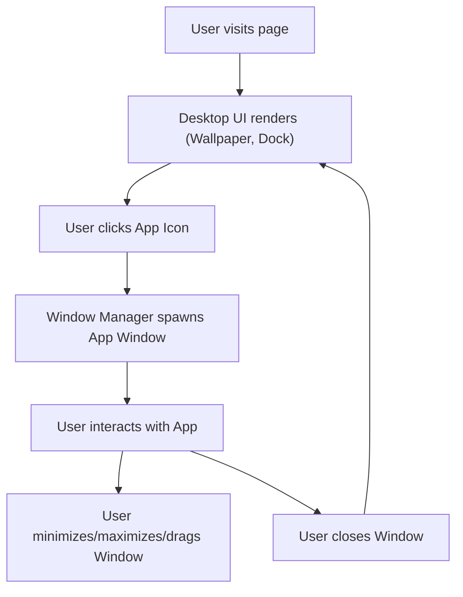

## 1. Product Overview
A web-based simulation of a Linux-style desktop environment featuring a full window management system and a suite of 10+ integrated applications.
- Provides users with an interactive, immersive desktop experience directly in the browser, complete with a taskbar, draggable windows, and realistic app functionalities.
- Showcases advanced frontend architecture, state management, and creative UI/UX design.

## 2. Core Features

### 2.1 User Roles
| Role | Registration Method | Core Permissions |
|------|---------------------|------------------|
| Guest User | No registration | Access all desktop features and apps in a stateless session |

### 2.2 Feature Module
1. **Desktop Environment**: Desktop workspace, wallpaper, bottom dock/taskbar, top system panel.
2. **Window Manager**: Draggable, resizable, maximizable, and minimizable windows with stacking order (z-index).
3. **Core Applications (12 total)**:
   - Terminal (command line simulator)
   - File Explorer (virtual file system)
   - Text Editor (basic notepad)
   - Settings (personalization)
   - System Monitor (mock resource usage)
   - Calculator (standard math)
   - Browser (iframe viewer)
   - Calendar (monthly view)
   - Clock (world clock & timer)
   - Weather (mock weather conditions)
   - Snake (classic game)
   - Image Viewer (gallery)

### 2.3 Page Details
| Page Name | Module Name | Feature description |
|-----------|-------------|---------------------|
| Desktop | Workspace | Renders wallpaper and desktop icons. Manages window rendering layer. |
| Desktop | Top Panel | Shows active app name, time, date, and system tray (network, battery). |
| Desktop | Dock | Bottom centered bar. Shows pinned apps, open windows, and minimized states. |
| Window | Window Frame | Header bar with close/minimize/maximize buttons. Draggable area. |
| App | Terminal | Mock command-line interface supporting basic commands (ls, cd, echo, clear). |
| App | File Explorer | Navigates a virtual file system structure. |
| App | System Monitor | Displays mock dynamic charts for CPU and Memory usage. |
| App | Settings | Allows changing the desktop wallpaper and theme color. |

## 3. Core Process
The user lands on the desktop interface, clicks an app icon on the dock, which spawns a new window. The user interacts with the app, opens more apps, drags them around, minimizes them to the taskbar, and closes them.

## 4. User Interface Design
### 4.1 Design Style
- Primary color: Deep charcoal/black (`#0a0a0c`) for panels and window borders, creating a sleek dark mode.
- Secondary/Accent color: Neon Cyan (`#00F0FF`) and Deep Purple (`#7000FF`) for accents and highlights.
- Button style: Flat, minimal, slightly rounded corners (6px), glassmorphism effects for the dock and panels.
- Font and sizes: 'DM Sans' for general UI elements, 'JetBrains Mono' for Terminal and Code environments.
- Layout style: Desktop layout with absolute positioned windows, bottom dock for apps, top thin panel for system tray.
- Icon/emoji style suggestions: Minimalist stroke SVG icons (e.g., Lucide).

### 4.2 Page Design Overview
| Page Name | Module Name | UI Elements |
|-----------|-------------|-------------|
| Desktop | Background | High-quality atmospheric abstract background (CSS gradient mesh). |
| Desktop | Dock | Frosted glass effect (backdrop-filter: blur), centered app icons with hover tooltips and indicator dots for open apps. |
| Window | Titlebar | Dark gray/black, sleek close/minimize/maximize circles (macOS/Linux style). |
| Terminal | Content | Pure black background, neon cyan monospace text, blinking cursor. |

### 4.3 Responsiveness
Desktop-first design. The desktop environment requires a minimum viewport size. On mobile devices, windows will maximize to fill the screen and the dock will adapt to a simpler app drawer.
