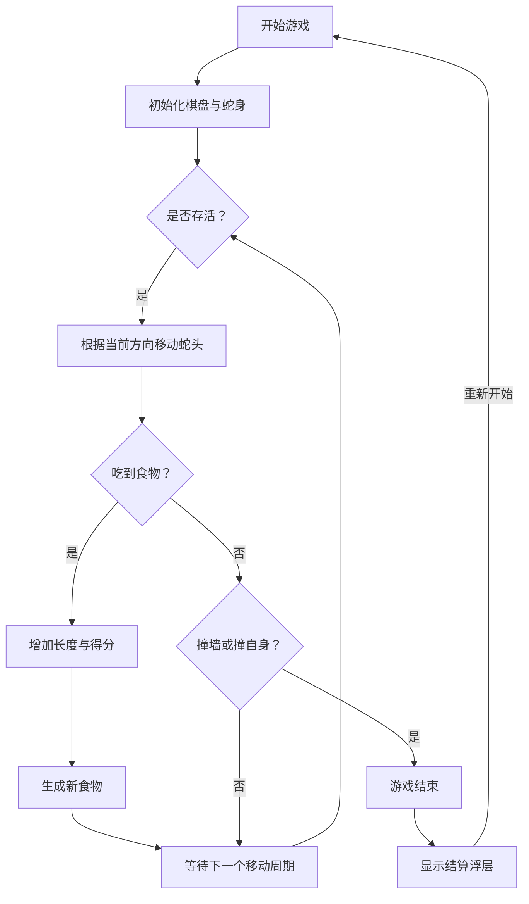

## 1. 产品概述
一款视觉惊艳、现代感十足的经典贪吃蛇网页游戏。
- 采用复古未来主义（Retro-Futuristic）与赛博朋克霓虹（Cyberpunk Neon）风格，为经典游戏玩法注入极致的视听反馈与现代前端技术，面向休闲玩家和注重设计的用户。
- 解决传统贪吃蛇游戏视觉单调的问题，打造一个既能唤起怀旧感，又具备高水准UI/UX体验的现代Web小游戏。

## 2. 核心功能

### 2.1 用户角色
（不适用，纯客户端单机游戏）

### 2.2 功能模块
1. **游戏主页**：核心棋盘、得分显示、控制说明、游戏状态提示层。

### 2.3 页面详情
| 页面名称 | 模块名称 | 功能描述 |
|-----------|-------------|---------------------|
| 游戏主页 | 顶部状态栏 | 显示当前得分、历史最高分以及游戏标题。 |
| 游戏主页 | 核心棋盘 | 渲染蛇身、食物，处理蛇的移动与碰撞，并带入动态发光特效。 |
| 游戏主页 | 浮层提示 | "开始游戏"、"游戏结束"弹窗及"重新开始"按钮。 |
| 游戏主页 | 控制面板 | 桌面端键盘按键映射提示，以及移动端滑动手势支持。 |

## 3. 核心流程
用户点击开始游戏后，蛇开始按初始方向自动移动。
用户通过键盘方向键或屏幕滑动控制改变蛇的移动方向。
当蛇头吃到食物时，得分增加，蛇身变长，食物在随机空白位置重新生成。
如果蛇头撞到墙壁或自身，则游戏结束。
用户可随时点击重新开始。

## 4. 用户界面设计
### 4.1 设计风格
- **整体风格**：复古街机/赛博朋克霓虹风 (Retro-futuristic / Cyberpunk Neon)
- **主题色彩**：
  - 背景：深空黑 (`#0a0a0c`)，带有暗色网格或 CRT 扫描线纹理。
  - 蛇身：高饱和度荧光绿或霓虹蓝渐变，蛇头带有强烈发光效果。
  - 食物：发光的霓虹粉或红色（类似能量块或发光宝石）。
- **字体**：选用复古像素风字体或现代硬朗的无衬线字体（如 `Space Grotesk`，用于数字与标题）。
- **按钮样式**：带发光边框的玻璃拟物化 (Glassmorphism) 按钮，悬浮时有强烈的视觉反馈。

### 4.2 页面设计概览
| 页面名称 | 模块名称 | UI 元素 |
|-----------|-------------|-------------|
| 游戏主页 | 棋盘容器 | 带有微弱发光边框的暗色网格，居中显示。 |
| 游戏主页 | 蛇与食物 | 圆角矩形，发光阴影(`box-shadow`)，平滑的步进移动效果。 |
| 游戏主页 | 结算浮层 | 半透明模糊背景 (`backdrop-blur`)，高亮文字与发光按钮。 |

### 4.3 响应式设计
- **桌面端优先**：居中布局，支持方向键 (`ArrowKeys` 或 `WASD`) 控制。
- **移动端适配**：支持全屏幕滑动控制（Swipe），锁定浏览器默认滚动与下拉刷新，确保棋盘自适应屏幕宽度。
