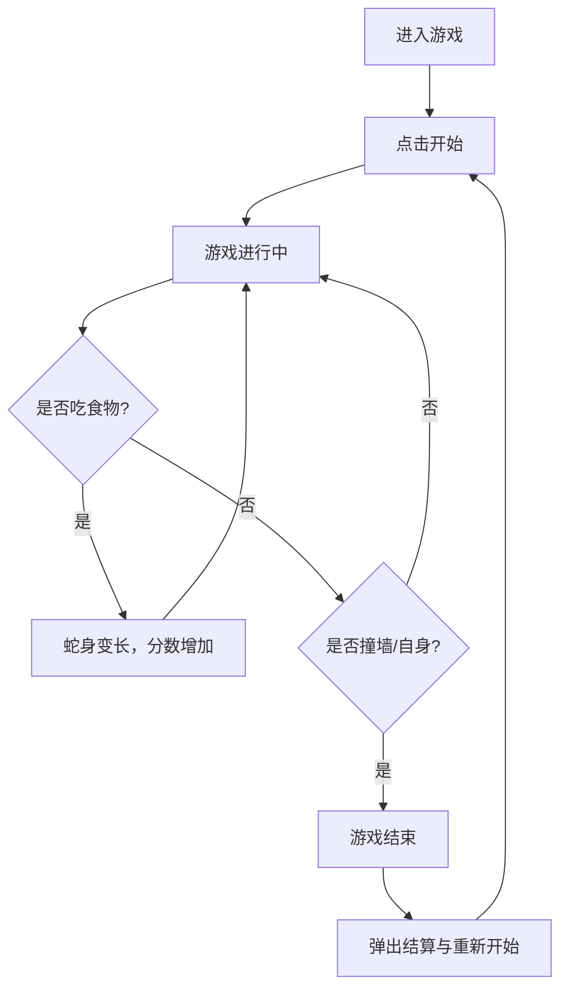

## 1. 产品概述
创建一个现代化、具有优秀视觉设计的网页版贪吃蛇游戏。
- 解决的问题：提供一个有趣、休闲的网页游戏体验，展示现代网页前端的动画和视觉设计能力。
- 目标用户：所有喜爱休闲游戏的玩家。
- 核心价值：通过精致的 UI/UX 和流畅的操作体验，重塑经典的贪吃蛇游戏。

## 2. 核心功能

### 2.1 用户角色
| 角色 | 注册方式 | 核心权限 |
|------|----------|----------|
| 玩家 | 无需注册 | 游玩游戏，查看本地最高分 |

### 2.2 功能模块
1. **游戏主页**：标题、开始/暂停按钮、当前分数、历史最高分。
2. **游戏区域**：网格化地图、蛇身、食物、碰撞检测。
3. **结算弹窗**：游戏结束时的得分展示、重新开始按钮。

### 2.3 页面详情
| 页面名称 | 模块名称 | 功能描述 |
|----------|----------|----------|
| 主界面 | 状态栏 | 显示当前分数、最高分、游戏状态（进行中/暂停/结束） |
| 主界面 | 游戏画布 | 渲染网格、蛇的移动逻辑、食物的随机生成、吃食物逻辑 |
| 主界面 | 控制面板 | 移动端屏幕方向键（可选）/ 键盘监听，用于控制蛇的移动方向 |

## 3. 核心流程
用户进入游戏后，点击开始，通过键盘或屏幕按钮控制蛇移动。吃掉食物后蛇身变长并增加分数。若撞墙或撞击自身，游戏结束，弹出结算与重新开始的提示。

## 4. 用户界面设计

### 4.1 设计风格
- 整体风格：霓虹赛博朋克风 (Cyberpunk / Neon)，背景为深色，蛇身和食物带有强烈的发光效果。
- 主色调：深邃暗蓝背景 (`#0f172a` 及其变体)，霓虹绿作为蛇身 (`#22c55e` 带辉光)，霓虹红/粉作为食物 (`#ef4444` 带辉光)。
- 按钮风格：带有光晕效果的现代圆角按钮，悬停时发光增强，具有科技感。
- 字体：使用 `monospace` 字体或现代科技感无衬线字体 (如 Roboto Mono)。
- 布局风格：居中卡片式布局，上方状态面板，中间游戏区域，下方（或移动端）操作提示。

### 4.2 页面设计概览
| 页面名称 | 模块名称 | UI 元素 |
|----------|----------|---------|
| 主界面 | 背景与外框 | 带有细微网格线和发光边框的深色背景，现代玻璃拟物态卡片 |
| 主界面 | 游戏区域 | 网格化界面，发光方块代表蛇身和食物，流畅的逐帧过渡 |

### 4.3 响应式设计
- 优先适配桌面端（键盘方向键 / WASD 控制）。
- 移动端适配：屏幕下方增加虚拟方向键面板，支持触摸点击操作，自适应屏幕宽度。

### 4.4 3D/动画指导
- 2D 实现，但利用 CSS `box-shadow` 创建强烈的 3D 霓虹深度感。
- 蛇吃食物时添加微妙的 CSS 动画效果（如尺寸跳动）。
- 游戏结束时添加屏幕震动或闪烁反馈。
