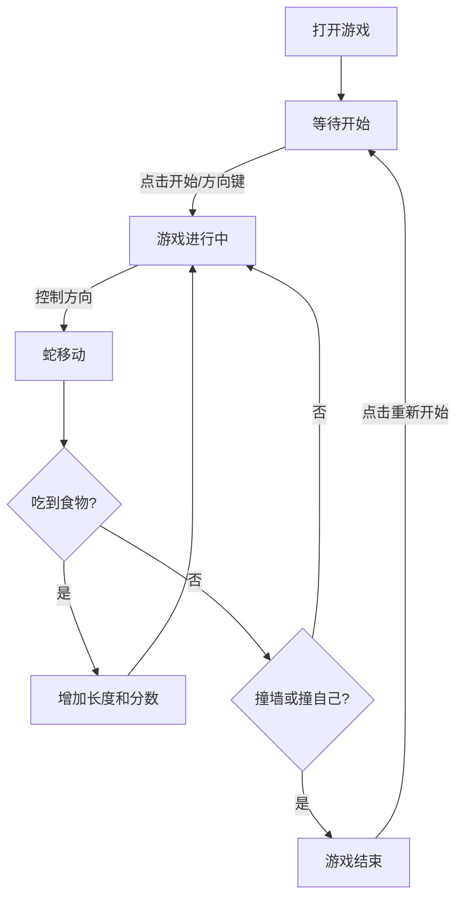

## 1. 产品概述
一个基于 Web 的经典贪吃蛇游戏。
- 主要解决用户休闲娱乐需求，提供简洁、美观且具有挑战性的游戏体验。
- 具有复古但现代的视觉风格，支持响应式设计，适配桌面和移动端。

## 2. 核心功能

### 2.1 功能模块
1. **游戏主界面**：游戏画布、计分板、控制按钮
2. **游戏逻辑**：蛇的移动、食物生成、碰撞检测、分数计算
3. **状态管理**：游戏开始、暂停、结束、重新开始

### 2.2 页面详情
| 页面名称 | 模块名称 | 功能描述 |
|-----------|-------------|---------------------|
| 游戏主页 | 计分板 | 实时显示当前分数和最高分数 |
| 游戏主页 | 游戏画布 | 渲染网格、蛇身和食物 |
| 游戏主页 | 控制台 | 提供开始/暂停/重新开始按钮，移动端提供方向控制 |

## 3. 核心流程
玩家控制贪吃蛇吃食物，获取分数并增长，避免碰撞。

## 4. 用户界面设计
### 4.1 设计风格
- **主色调**：深邃的背景色（如暗夜黑），配合高饱和度的霓虹色（荧光绿的蛇，荧光红的食物），营造现代赛博朋克或复古街机感。
- **按钮风格**：极简现代风格，带有悬浮发光效果。
- **字体**：现代等宽字体，用于清晰显示分数。
- **布局风格**：居中对齐，重点突出游戏区域。

### 4.2 页面设计概述
| 页面名称 | 模块名称 | UI 元素 |
|-----------|-------------|-------------|
| 游戏主页 | 游戏区域 | 带有细微网格的深色背景，发光的蛇身和食物，优雅的结束弹窗 |

### 4.3 响应式设计
- 桌面优先设计，游戏区域在屏幕居中。
- 移动端自动调整网格大小以适应屏幕宽度。
- 移动端底部提供半透明的虚拟方向按键，方便触摸操作。
