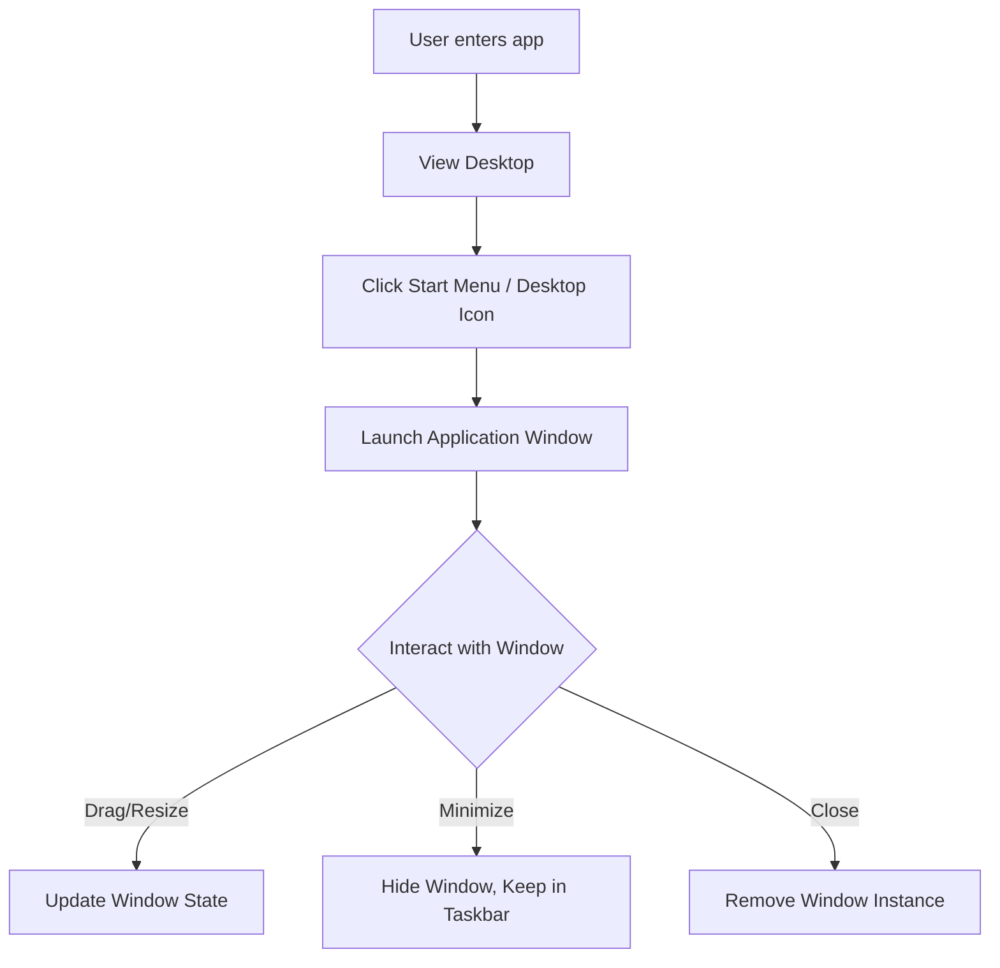

## 1. Product Overview
A web-based desktop environment mimicking classic Linux desktop interfaces (like GNOME or XFCE). 
- **Purpose:** To provide a familiar, interactive desktop experience entirely in the browser, demonstrating advanced frontend capabilities.
- **Target Value:** A nostalgic, highly interactive portfolio piece or web playground with a distinctive Linux-inspired aesthetic.

## 2. Core Features

### 2.1 Feature Module
1. **Desktop Workspace**: Icons, context menus, customizable wallpaper.
2. **Window Manager**: Draggable, resizable, minimizable, maximizable overlapping windows with z-index control.
3. **Taskbar/Panel**: Start menu launcher, open applications list, system tray (clock, mock network/volume icons).
4. **Applications**:
   - **Terminal**: A mock command-line interface supporting basic commands.
   - **File Explorer**: A mock file system navigator.
   - **Text Editor**: A simple editor for mock text files.
   - **Settings**: Theme and system configuration.

### 2.2 Page Details
| Page Name | Module Name | Feature description |
|-----------|-------------|---------------------|
| Main App  | Desktop     | Main container holding desktop icons and wallpaper. |
| Main App  | Window      | Reusable container for all apps (drag, resize, focus). |
| Main App  | Taskbar     | Bottom panel with Start Menu, active windows, and clock. |
| Apps      | Terminal    | Executes mock commands (`ls`, `echo`, `clear`, etc.). |
| Apps      | Explorer    | Navigates the mock directory structure. |

## 3. Core Process
The user lands on the desktop. They can click the Start menu to launch an app, or double-click a desktop icon. This opens a new Window instance. The user can drag, resize, maximize, minimize, or close the window. Minimizing sends it to the taskbar.

## 4. User Interface Design
### 4.1 Design Style
- **Aesthetic Direction:** Brutalist/Utilitarian Linux Desktop (e.g., reminiscent of older GNOME or XFCE themes but polished for modern web).
- **Colors:** Deep terminal blacks, system grays, high-contrast accent colors (like Ubuntu orange or Arch blue).
- **Typography:** Monospaced fonts for terminal and code, sans-serif system fonts (e.g., Ubuntu, Inter) for UI elements.
- **Motion:** Snappy window opening/closing animations, subtle hover effects on taskbar items.
- **Layout:** Full-screen desktop, absolute positioned overlapping windows, fixed bottom taskbar.

### 4.2 Page Design Overview
| Page Name | Module Name | UI Elements |
|-----------|-------------|-------------|
| Main App  | Desktop     | Full viewport, background image/color, grid-aligned icons. |
| Main App  | Window      | Title bar with close/min/max buttons, content area with border shadow. |
| Main App  | Taskbar     | Fixed at bottom, semi-transparent dark gray, system tray on right. |

### 4.3 Responsiveness
Desktop-first design. On mobile devices, windows should maximize by default, and complex dragging is disabled for better touch experience.
