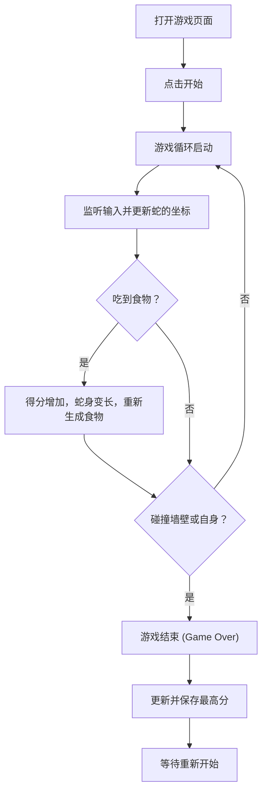

## 1. 产品概述
本项目是一个基于 Web 端的现代复古赛博朋克风格的“贪吃蛇”游戏。
- 主要目标是提供一个视觉表现惊艳、操作流畅的经典游戏体验，适合休闲娱乐。
- 采用发光霓虹特效、流畅的动画过渡以及现代化的界面设计，赋予经典玩法全新的生命力。

## 2. 核心功能

### 2.1 用户角色
| 角色 | 注册方式 | 核心权限 |
|------|----------|----------|
| 玩家 | 无需注册 | 开始游戏、暂停游戏、查看当前得分与最高分 |

### 2.2 功能模块
1. **游戏主界面**：包含游戏网格（画布）、当前得分、历史最高分、游戏控制面板（开始/暂停/重新开始）。
2. **游戏核心逻辑**：蛇的移动、吃食物判定、身体增长、撞墙或撞自身判定（游戏结束）。
3. **移动端控制**：在移动设备上显示虚拟方向键或支持滑动操作。

### 2.3 页面详情
| 页面名称 | 模块名称 | 功能描述 |
|----------|----------|----------|
| 游戏主页 | 状态信息栏 | 显示当前得分（Score）与最高分（High Score）。 |
| 游戏主页 | 游戏画布 | 渲染霓虹风格的网格、蛇身（发光效果）、食物（闪烁效果）。 |
| 游戏主页 | 控制面板 | 包含“开始”、“暂停”、“重新开始”按钮，以及 Game Over 提示遮罩。 |
| 游戏主页 | 虚拟按键 | 在屏幕宽度较小时显示上下左右控制键。 |

## 3. 核心流程
游戏主要流程如下：
玩家打开网页 -> 点击“开始游戏” -> 监听键盘方向键或屏幕滑动 -> 蛇按照当前方向移动 -> 判定是否吃到食物（是则加分并变长） -> 判定是否碰撞（是则游戏结束） -> 更新最高分记录。

## 4. 用户界面设计

### 4.1 设计风格
- **整体色调**：深邃的背景（如深紫黑 `#0b0914`），配合高亮霓虹色。
- **主次颜色**：赛博朋克青色（Cyan `#00f3ff`）作为主色（蛇的头部/身体），霓虹粉色（Pink `#ff003c`）作为点缀色（食物）。
- **按钮样式**：带发光边框的圆角按钮（Glassmorphism 或 Neon 风格），悬停时增加发光强度。
- **字体与大小**：数字与标题采用现代无衬线字体（如 `'Inter'`），并辅以发光特效。
- **布局风格**：居中卡片式布局，上方计分板，中间游戏区域，下方操作提示。

### 4.2 页面设计总览
| 页面名称 | 模块名称 | UI 元素 |
|----------|----------|---------|
| 游戏主页 | 计分板 | 大字号数字，发光文字效果，居中对齐。 |
| 游戏主页 | 游戏画布 | 带有暗色网格线的深色背景，蛇身带有 `box-shadow` 霓虹发光特效。 |

### 4.3 响应式设计
优先适配桌面端（键盘操作为主），当屏幕宽度小于 768px 时，自动缩小画布尺寸，并在底部显示虚拟方向盘以便触摸屏玩家操作。
