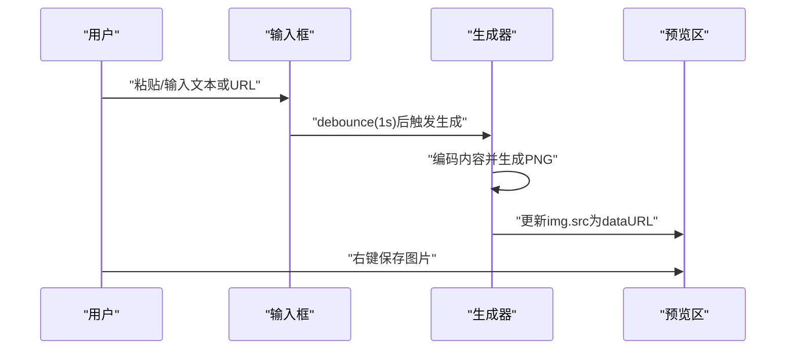

# PRD：极简在线二维码生成工具

## 1. 背景与目标
用户经常需要把网址、邀请码、文本片段快速变成可扫描的二维码，用于分享、打印或投放。目标是提供一个无需注册、无需安装、打开即用的极简 Web 工具。

**产品目标**
- 用户粘贴任意网址或文本后，自动生成可扫描的二维码
- 二维码可直接右键保存为图片（优先 PNG）
- 极简界面、响应式布局、加载快、生成快
- 全程匿名、无登录、无服务器存储

**非目标**
- 不做账号体系、历史记录云同步、二维码模板市场
- 不做二维码美化（Logo/彩色/渐变）作为第一版必须项
- 不做批量生成、导出 ZIP 作为第一版必须项

## 2. 目标用户与使用场景
**目标用户**
- 普通用户：分享链接、社交资料、活动页面
- 运营/销售/活动组织者：把短文案、报名链接快速生成二维码
- 开发/测试：把本地或线上 URL 快速转二维码测试扫码

**核心场景**
- 打开网页 → 粘贴文本/URL → 立即出现二维码 → 右键保存 → 发给他人/打印

## 3. 核心体验原则（UX）
- **单一任务**：页面只围绕“输入 → 生成 → 保存”
- **零步骤**：不出现“生成”按钮；用户停止输入后自动生成
- **明确反馈**：输入为空/过长/不适合编码时给出清晰提示
- **可扫描优先**：保证对比度、尺寸、纠错等级与静区（quiet zone）
- **可用性优先**：键盘可用、移动端可用、低端设备也流畅

## 4. 功能需求

### 4.1 输入框
**描述**
- 单个大文本输入框，placeholder 明确：`粘贴你的网址或文本链接`
- 支持：
  - `http://`、`https://` 链接
  - 任意纯文本（包括中文、空格、换行）

**交互**
- 用户输入或粘贴后自动触发生成
- 默认在用户停止输入 **1 秒**后生成（debounce 1s）
- 提供“一键清空”能力（可选但推荐）

**边界**
- 空输入：不生成二维码，显示引导文案
- 超长输入：提示“内容过长，二维码密度过高可能影响识别”，仍尝试生成；若库报错则显示错误态

### 4.2 即时生成
**描述**
- 输入变化后在极短时间内生成二维码
- 使用 debounce 防止每个按键都重算

**性能指标（第一版目标）**
- 初次加载：静态资源在常见网络下尽量 < 1s（不做强制验收，但作为优化目标）
- 生成耗时：典型 URL（< 200 字符）在中端手机上 < 200ms

### 4.3 二维码显示
**描述**
- 输入框旁边或下方展示二维码
- 默认生成尺寸：建议 256–320px（随屏幕自适应）
- 纠错等级：默认 **M**（可后续扩展为可选）
- 保证静区（quiet zone）与清晰度

**可保存**
- 展示为 `img`，其 `src` 为 PNG data URL（或 Blob URL）
- 用户可直接右键“另存为图片”

### 4.4 保存功能
**要求**
- 不提供下载按钮也能保存（核心是右键保存）
- 图片格式优先 PNG
- 若后续加“下载”按钮，也必须保持右键保存可用

## 5. 信息架构与页面结构
单页应用（Single Page），无路由。

页面区块（从上到下）：
- 顶部标题/一句话说明
- 大输入框（含 placeholder、清空）
- 二维码预览区（含错误/空态）
- 极简页脚（可选：隐私说明“不会上传你的内容”）

## 6. 视觉与响应式要求
- **极简**：减少边框与装饰，使用高对比与留白
- **桌面优先**：桌面端输入与二维码并排；窄屏改为上下布局
- **移动友好**：输入框高可触、字体可读、二维码不溢出

## 7. 可访问性（A11y）
- 输入框具备可读 label（可隐藏视觉但需可被读屏读取）
- 错误提示可被读屏理解（aria-live）
- 保证对比度；二维码背景纯白、前景纯黑（第一版）

## 8. 隐私与安全
- 不采集、不上传用户输入内容
- 不写入服务器日志（第一版目标：纯静态站点，无后端）
- 防止 XSS：不把输入当 HTML 渲染；只作为二维码编码内容

## 9. 里程碑（建议）
- M1：最小可用（输入 → debounce → 生成 → img 展示 → 右键保存）
- M2：体验增强（清空、错误态、尺寸自适应、加载性能优化）
- M3：可选高级（纠错等级选择、尺寸选择、下载按钮、离线缓存）

## 10. 交互流程（Mermaid）

