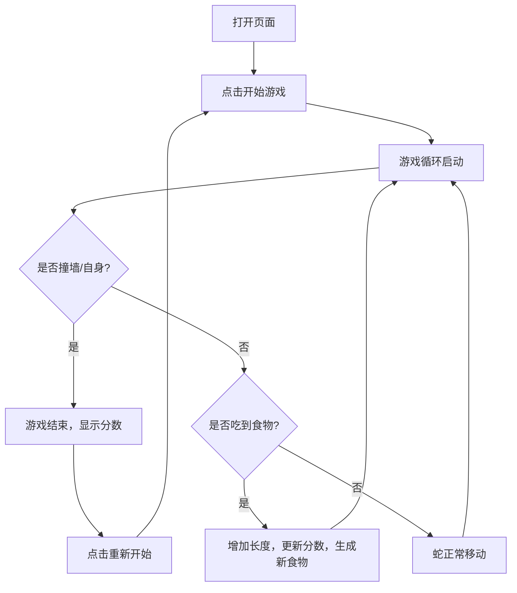

# 产品需求文档 (PRD)

## 1. 产品概述
一款具有赛博朋克霓虹风格（Neon Arcade）的网页版贪吃蛇游戏。
核心目的是提供一个具有极高视觉冲击力和流畅操作体验的经典游戏，旨在为玩家带来沉浸式的街机回忆与现代前端技术的完美结合。

## 2. 核心功能
### 2.1 功能模块
1. **游戏主界面**: 包含游戏画布、分数面板、最高分记录、开始/暂停按钮。
2. **游戏逻辑**: 蛇的移动、吃食物变长、撞墙或撞自身导致游戏结束、得分系统。
3. **设置模块**: 难度选择（速度调节）。

### 2.2 页面详情
| 页面名称 | 模块名称 | 功能描述 |
|-----------|-------------|---------------------|
| 游戏主页 | 计分板 | 实时显示当前分数和历史最高分 |
| 游戏主页 | 游戏区 | 贪吃蛇活动区域，网格化布局，响应键盘方向键控制 |
| 游戏主页 | 控制面板 | 开始、暂停、重新开始按钮，难度选择下拉或单选 |
| 游戏主页 | 游戏结束弹窗 | 显示最终得分，并提供“再来一局”按钮 |

## 3. 核心流程
玩家打开网页后，看到霓虹风格的界面。点击开始游戏，蛇开始移动。玩家通过方向键控制蛇的方向，吃到食物得分并变长，撞墙或自身则游戏结束，弹出结算界面。

## 4. 用户界面设计
### 4.1 设计风格
- **主色调**: 深邃黑底色（#0a0a10），搭配霓虹绿（#39ff14）、电光紫（#b026ff）和亮粉色（#ff007f）。
- **按钮风格**: 发光边框，悬浮时有强烈的辉光效果（glow effect）。
- **字体**: 采用具有科技感的无衬线字体（如 'Orbitron' 或 monospace 字体）。
- **布局**: 居中对齐的街机机台风格，网格线微光隐现。
- **动效**: 食物出现时的闪烁效果，蛇移动时的尾迹渐变。

### 4.2 页面设计概览
| 页面名称 | 模块名称 | UI 元素 |
|-----------|-------------|-------------|
| 游戏主页 | 游戏画布 | 黑色背景，带有暗淡的网格线，发光的蛇身和闪烁的食物 |
| 游戏主页 | 信息面板 | 大字体的发光数字显示分数 |

### 4.3 响应式设计
- **桌面端优先**: 游戏画布尺寸固定或自适应，支持键盘方向键操作（WASD或上下左右）。
- **移动端适配**: 屏幕下方显示虚拟方向按键，支持触屏操作。
