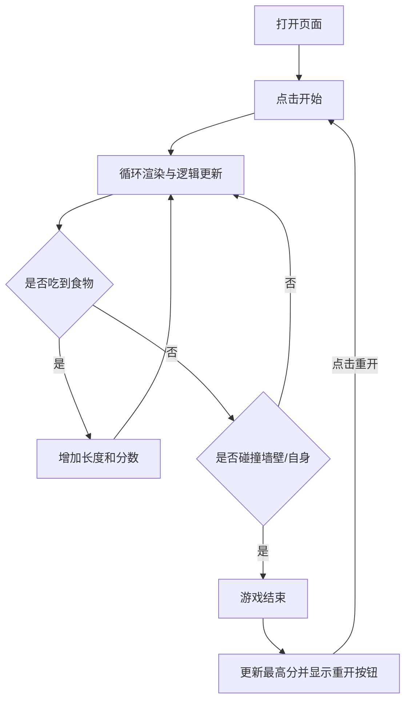

## 1. 产品概述
网页版贪吃蛇游戏。
- 主要解决在网页端休闲娱乐的需求，目标用户为喜欢经典游戏的玩家。
- 采用现代化、精美的 UI 设计，为经典游戏注入新的视觉体验，特别是霓虹复古（Neon Retro）风格的强视觉冲击力。

## 2. 核心功能

### 2.1 用户角色
无需区分角色，所有玩家均可直接游玩。

### 2.2 功能模块
1. **游戏主页**: 包含游戏区域、分数面板、开始/暂停/重新开始控制按钮、游戏难度设置。

### 2.3 页面详情
| 页面名称 | 模块名称 | 功能描述 |
|-----------|-------------|---------------------|
| 游戏主页 | 游戏画布 | 渲染蛇、食物、网格背景，处理蛇的移动和碰撞逻辑。 |
| 游戏主页 | 状态面板 | 显示当前分数、最高分。 |
| 游戏主页 | 控制面板 | 开始、暂停、重新开始按钮，以及方向控制按键提示。 |
| 游戏主页 | 难度设置 | 可选择简单、中等、困难，改变蛇的初始移动速度。 |

## 3. 核心流程
1. 玩家进入页面，看到游戏界面和操作说明。
2. 玩家点击“开始游戏”，蛇开始以默认速度移动。
3. 玩家通过键盘方向键控制蛇的移动方向。
4. 蛇吃到食物，分数增加，身体变长，速度略微提升。
5. 蛇撞到墙壁或自己的身体，游戏结束，显示最终分数并更新最高分。
6. 玩家可以点击“重新开始”进行下一局。

## 4. 用户界面设计

### 4.1 设计风格
- 整体风格：赛博朋克/霓虹复古风 (Neon Retro/Cyberpunk) 或者极简现代风。这里我们选择**霓虹复古风**，深色背景搭配高饱和度发光色彩，视觉冲击力强。
- 主色调和辅色：深灰/纯黑背景 (`#0f0f13`)，蛇身为霓虹绿 (`#39ff14`)，食物为霓虹粉/红 (`#ff007f`)。
- 按钮样式：圆角矩形，悬浮时有发光效果 (Glow effect) 和过渡动画。
- 字体：采用等宽字体 (如 Fira Code, Roboto Mono) 强调游戏感和数字的跳动。
- 布局风格：居中卡片式布局，游戏区域位于正中，上方为计分板，下方为控制说明。

### 4.2 页面设计总览
| 页面名称 | 模块名称 | UI 元素 |
|-----------|-------------|-------------|
| 游戏主页 | 整体布局 | 深色发光背景，网格装饰，发光边框。 |
| 游戏主页 | 游戏区域 | 黑色画布背景，发光的蛇身方块和跳动的食物方块。 |
| 游戏主页 | 分数面板 | 大号霓虹发光数字，显示当前得分和最高分，并伴随吃食物时的缩放特效。 |

### 4.3 响应式设计
优先适配桌面端，提供键盘 (W/A/S/D 或方向键) 操作；针对移动端，可以适配屏幕尺寸并提供屏幕虚拟方向按钮。
