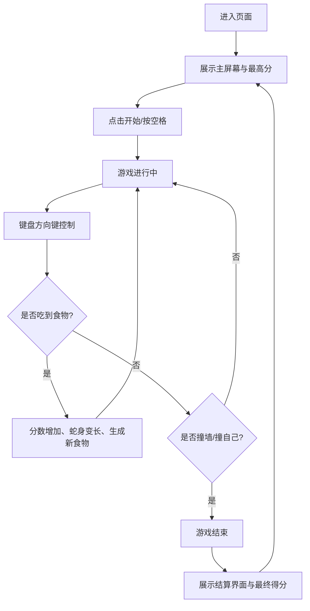

## 1. 产品概述
这是一款基于Web的复古赛博朋克风格的经典贪吃蛇游戏，旨在提供沉浸式的街机体验。
- 解决用户在碎片时间的娱乐需求，通过高品质的视觉设计和流畅的操作手感提升游戏体验。
- 采用独特的霓虹发光美学，使其在众多同类游戏中脱颖而出。

## 2. 核心功能

### 2.1 用户角色
| 角色 | 注册方式 | 核心权限 |
|------|---------------------|------------------|
| 玩家 | 免注册即玩 | 进行游戏、记录本地最高分 |

### 2.2 功能模块
1. **主屏幕（开始界面）**：游戏标题、最高分展示、开始按钮。
2. **游戏主界面**：网格地图、贪吃蛇本体、食物（发光效果）、实时分数。
3. **结算界面**：游戏结束提示、最终得分、重新开始按钮。

### 2.3 页面详情
| 页面名称 | 模块名称 | 功能描述 |
|-----------|-------------|---------------------|
| 主屏幕 | 标题与开始 | 闪烁的霓虹标题，点击开始或按空格键进入游戏 |
| 游戏主界面 | 游戏画布 | 监听方向键控制蛇的移动，处理吃食物变长、撞墙或撞自己结束游戏的逻辑 |
| 游戏主界面 | 计分板 | 实时更新当前分数与历史最高分（存储于 localStorage） |
| 结算界面 | 游戏结束弹窗 | 显示Game Over，提供重玩选项 |

## 3. 核心流程
用户进入页面 -> 看到主屏幕和最高分 -> 点击开始 -> 键盘控制蛇移动 -> 吃食物得分 -> 死亡 -> 结算界面 -> 重新开始。

## 4. 用户界面设计
### 4.1 设计风格
- 主色调：深空黑（背景）、霓虹青（蛇身）、荧光粉（食物）。
- 按钮风格：带有霓虹发光边框和悬浮特效的赛博朋克风格按钮。
- 字体：使用独特的等宽/像素/科幻字体（如 `Orbitron` 或 `Press Start 2P`）。
- 布局风格：居中对齐，外围带有扫描线或网格装饰。
- 动效：蛇吃食物时有光晕扩散，游戏结束时有屏幕震动或闪烁效果。

### 4.2 页面设计概览
| 页面名称 | 模块名称 | UI元素 |
|-----------|-------------|-------------|
| 主屏幕 | 游戏容器 | 深色背景网格，居中的发光标题，跳动的"PRESS START"文本 |
| 游戏界面 | 画布/网格 | 响应式居中的正方形区域，发光的方块代表蛇的节点 |

### 4.3 响应式设计
优先适配桌面端（使用键盘方向键控制），同时在移动端屏幕上显示虚拟方向摇杆或按钮以支持触摸操作。
