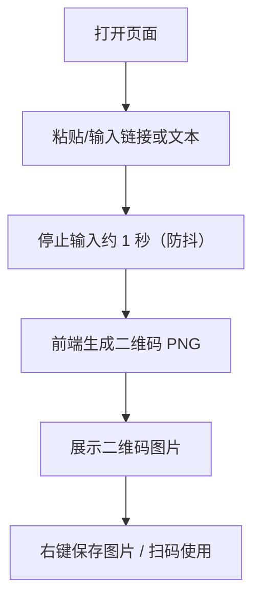

# 极简在线二维码生成器（匿名版）PRD

## 1. Product Overview
一个打开即用的在线二维码生成工具：用户粘贴网址或任意文本后，页面在极短时间内自动生成可右键保存的清晰二维码图片。
- 解决问题：快速把链接/文本转换为可扫描二维码，避免安装/登录/复杂配置
- 目标用户：需要临时分享链接/文本的个人用户；运营/销售/产品等轻量办公场景

## 2. Core Features

### 2.1 User Roles (if applicable)
不区分角色；匿名使用。

### 2.2 Feature Module
1. **单页工具页（/）**：输入区域、二维码预览、基础状态提示（空值/生成中/可保存）

### 2.3 Page Details
| Page Name | Module Name | Feature description |
|-----------|-------------|---------------------|
| / | 文本输入框 | 大尺寸多行输入，提示“粘贴你的网址或文本链接”；支持 HTTP/HTTPS 与纯文本 |
| / | 即时生成逻辑 | 输入变化后自动生成；采用 1 秒防抖（用户停止输入后生成） |
| / | 二维码预览 | 清晰大尺寸二维码图像展示；保证常见手机扫码成功率 |
| / | 保存能力 | 二维码以 PNG 图片形式渲染为 ``，支持浏览器右键“另存为图片” |
| / | 状态提示 | 空输入显示占位/引导；错误输入或生成失败给出简短提示（不暴露技术细节） |

## 3. Core Process
用户打开页面 → 粘贴/输入内容 → 停止输入约 1 秒 → 自动生成二维码 → 扫码或右键保存图片

## 4. User Interface Design
### 4.1 Design Style
- 方向：极简但有“印刷/票据”质感的工具页（高对比、克制动效、聚焦内容）
- 配色：近白纸张底色 + 深墨黑文字 + 单一强调色（用于聚焦/状态）
- 字体：标题使用具有个性的衬线或展示字体；正文使用可读性强的非系统字体（避免常见的 Inter/Roboto/Arial）
- 布局：桌面端左右两栏（输入 / 预览）；移动端上下堆叠
- 图标：尽量不用图标；仅在必要时用极简线性符号

### 4.2 Page Design Overview
| Page Name | Module Name | UI Elements |
|-----------|-------------|-------------|
| / | 输入区 | 大文本框、清晰占位提示、字符计数（可选）、粘贴后微动效高亮 |
| / | 预览区 | 大二维码图像、内容摘要（可选，避免泄露隐私时默认可折叠） |
| / | 状态反馈 | “等待输入 / 生成中 / 可保存 / 生成失败”简短文案 |

### 4.3 Responsiveness
- 桌面优先：≥1024px 双栏布局，预览区固定视觉中心
- 平板：双栏间距收紧，二维码尺寸自适应
- 手机：纵向堆叠；二维码保持足够尺寸（建议最小 240px）
- 触控优化：输入框高度充足；预览区可长按保存（由浏览器能力决定）

### 4.4 3D Scene Guidance (if applicable)
不适用。

