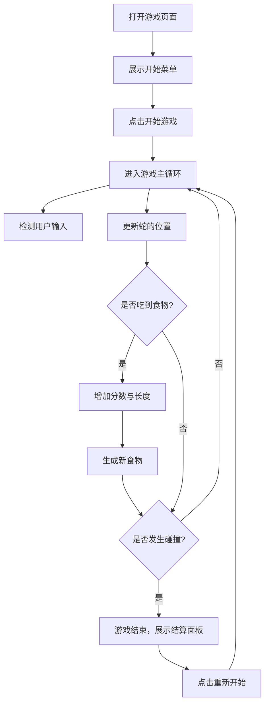

## 1. 产品概述
一个现代化、高品质视觉体验的网页版贪吃蛇游戏。
- 采用复古未来主义（Retro-futuristic）/ 赛博朋克（Cyberpunk）霓虹美学风格，提供流畅的动画与爽快的游玩体验。
- 目标受众为寻求休闲娱乐和视觉享受的网页端用户。

## 2. 核心功能

### 2.1 用户角色
由于是纯前端单机网页游戏，不涉及复杂的用户系统。所有用户均可直接体验完整游戏内容。

### 2.2 功能模块
1. **游戏主页/菜单界面**：开始游戏按钮、最高分展示、难度选择。
2. **游戏主界面**：贪吃蛇网格地图、实时分数面板、暂停/继续控制。
3. **结算界面**：游戏结束提示、最终得分、重新开始按钮。

### 2.3 页面详情
| 页面名称 | 模块名称 | 功能描述 |
|-----------|-------------|---------------------|
| 游戏主页 | 开始菜单 | 展示游戏名称，提供“开始游戏”交互，显示历史最高分。 |
| 游戏界面 | 游戏主舞台 | 渲染蛇的移动、食物生成、碰撞检测，以及分数统计。 |
| 结算界面 | 游戏结束面板 | 游戏失败（撞墙或咬到自己）时弹出，展示成绩并提供重玩选项。 |

## 3. 核心流程
用户打开网页后，看到霓虹风格的开始界面。点击“Start”后，游戏倒计时开始。用户通过方向键或屏幕虚拟按键（移动端）控制蛇的移动方向。吃掉发光食物后，蛇身变长，分数增加，同时游戏速度（难度）可能会随分数微调提升。当蛇头触碰边界或自身时，游戏结束，弹出结算面板。

## 4. 用户界面设计

### 4.1 设计风格
- **主色调与强调色**：深邃的暗色背景（如深紫/深黑 `#0B0B1A`），搭配高亮霓虹强调色（电光蓝 `#00F0FF`，荧光绿 `#39FF14`，霓虹粉 `#FF007F`）。
- **按钮风格**：发光边框，悬浮时带有明显的辉光扩散（Glow Effect）和色彩反转过渡。
- **字体与排版**：标题采用具有科技感或像素风的展示字体（如 `Orbitron` 或 `Press Start 2P`），正文采用清晰的无衬线字体（如 `Inter`）。
- **布局风格**：居中对齐，留白充足，突出游戏主视窗，周围伴有微妙的网格线或暗部渐变。
- **动画与特效**：食物带有脉冲呼吸动画，蛇的移动带有些许拖尾或平滑过渡，得分时数字带有弹跳效果。

### 4.2 页面设计概览
| 页面名称 | 模块名称 | UI元素设计 |
|-----------|-------------|-------------|
| 游戏主页 | 开始菜单 | 大号发光Logo，脉冲动画的“Start”按钮，暗黑渐变背景。 |
| 游戏界面 | 游戏主舞台 | 半透明网格背景，荧光绿色的蛇身（头部带有特殊高亮），粉色呼吸发光食物，顶部清晰的霓虹分数板。 |
| 结算界面 | 游戏结束面板 | 毛玻璃效果（Glassmorphism）叠加层，红色警告色调的“GAME OVER”文本，最终得分高亮展示。 |

### 4.3 响应式设计
- **桌面端优先**：通过键盘方向键（↑↓←→ / WASD）控制。主视窗居中，占据主要视觉中心。
- **移动端适配**：如果屏幕宽度较小，在下方提供虚拟的十字方向控制键或支持滑动（Swipe）手势控制。保证游戏网格在移动端自动缩放。
