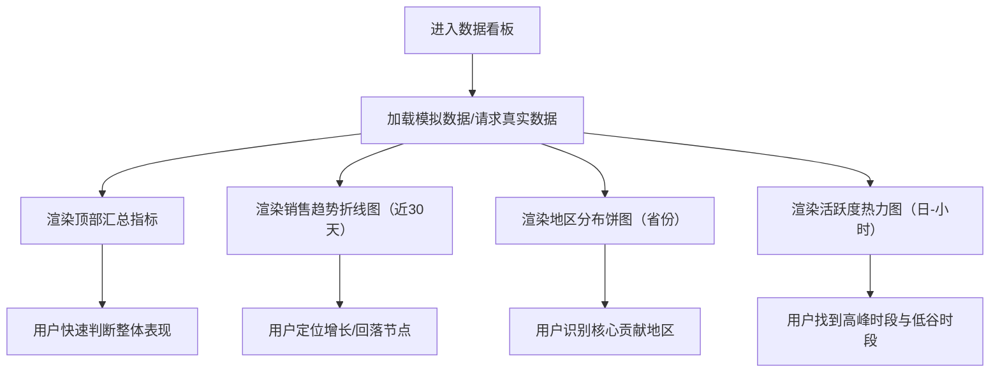

## 1. 产品概述
面向业务/运营的销售数据看板（单页），用于快速掌握近30天趋势、地区结构与用户活跃节律。
目标：用统一卡片式布局在 1 屏内完成“概览—趋势—结构—节律”的决策信息闭环。

## 2. 核心功能

### 2.1 功能模块
1. **数据看板页**：顶部汇总指标、销售趋势折线图（近30天）、地区分布饼图（不同省份）、用户活跃度热力图（日-小时分布）

### 2.2 页面详情
| 页面名称 | 模块名称 | 功能描述 |
|---|---|---|
| 数据看板 | 顶部汇总指标 | 展示用户数、转化率、日均收入；提供与昨日/上周对比的趋势标识（上升/下降、百分比） |
| 数据看板 | 销售趋势折线图 | 近30天按日收入或销售额折线；支持 tooltip 悬浮查看当日数值；显示均值参考线（可选） |
| 数据看板 | 地区分布饼图 | 按省份的订单/收入占比；图例可滚动；悬浮显示占比与绝对值 |
| 数据看板 | 用户活跃度热力图 | x 轴小时（0-23），y 轴日（周一-周日或最近7天）；颜色深浅表示活跃度；悬浮显示具体值 |

## 3. 核心流程
用户打开看板后，先查看顶部汇总指标，随后依次查看趋势、结构与节律分布；所有图表默认加载模拟数据，可替换为真实 API 数据源。

## 4. 用户界面设计

### 4.1 设计风格
- 视觉基调：深色数据控制台风格，信息密度适中，卡片简洁、边界清晰
- 主色/辅色：主色深石墨（背景），辅色电蓝/青色（强调），补色琥珀（预警/对比）
- 字体：标题用具有编辑气质的衬线字体，正文用等宽感弱、可读性强的无衬线字体（避免默认系统字体）
- 布局：顶部 KPI 横向三卡；下方 2 列网格卡片布局（折线/饼图/热力图按视觉权重排布）
- 交互：卡片 hover 轻微抬升；图表 tooltip 统一样式；加载时骨架/淡入动效（可选）

### 4.2 页面设计概览
| 页面名称 | 模块名称 | UI 元素 |
|---|---|---|
| 数据看板 | 顶部汇总指标 | 3 张 KPI 卡：数值、单位、对比趋势（↑↓）、说明标签；卡片背景轻微渐变与细边框 |
| 数据看板 | 销售趋势折线图 | 折线图标题、副标题（近30天）、图例（可选）、统一 tooltip；坐标轴低对比度 |
| 数据看板 | 地区分布饼图 | 饼图 + 图例列表（省份、数值、占比）；可滚动容器；统一 tooltip |
| 数据看板 | 用户活跃度热力图 | 热力图色带（legend）、轴标签（星期/小时）、统一 tooltip；低对比网格线 |

### 4.3 响应式
- 桌面优先：≥ 1200px 双列网格；≤ 1024px 自动变为单列堆叠
- 触控优化：卡片间距增大；tooltip 在移动端改为点击触发（可选）

