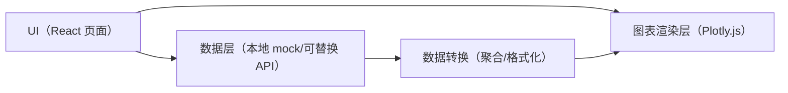

## 1. 架构设计



## 2. 技术说明
- 前端：React@18 + TypeScript + vite
- 样式：tailwindcss@3 + 少量全局 CSS 变量（主题色、阴影、边框）
- 图表：Plotly.js（同一套库覆盖折线、饼图、热力图）
- 数据：默认本地生成模拟数据（近30天、按省份分布、7×24 活跃度矩阵）；后续可替换为真实 API
- 后端：无（本任务仅前端页面）

## 3. 路由定义
| Route | Purpose |
|---|---|
| / | 数据看板主页面 |

## 4. 数据结构（前端）
```ts
export type KpiSummary = {
  users: number
  conversionRate: number
  avgDailyRevenue: number
  deltas: {
    usersPct: number
    conversionRatePct: number
    avgDailyRevenuePct: number
  }
}

export type TrendPoint = { date: string; value: number }

export type RegionSlice = { province: string; value: number }

export type HeatmapData = {
  days: string[]
  hours: number[]
  values: number[][]
}
```

## 5. 组件拆分建议
- DashboardPage：页面骨架与网格布局
- KpiCards：顶部指标卡
- SalesTrendCard：折线图卡（Plotly line）
- RegionPieCard：饼图卡（Plotly pie）
- ActivityHeatmapCard：热力图卡（Plotly heatmap）
- data/mock.ts：生成与格式化模拟数据（可替换为 API adapter）

## 6. 性能与可访问性
- 交互性能：图表容器固定高度，避免布局抖动；在窗口 resize 时节流更新尺寸（Plotly 默认处理但需避免频繁重绘）
- 可访问性：所有卡片标题使用语义化标签；为图表容器提供 aria-label 与简要描述文本（如需要）

