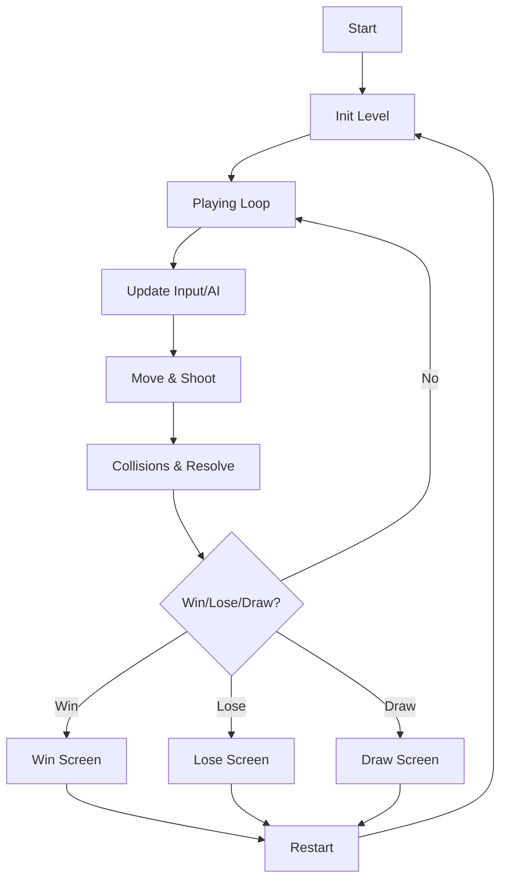

# 技术方案：简化版「坦克大战」（单文件 Canvas 版）

## 1. 技术约束
- 交付物：单文件 `index.html`（内含 CSS 与 JS）。
- 渲染：HTML5 Canvas 2D（无外部图片依赖，使用矢量/几何绘制）。
- 运行：静态打开或本地静态服务器均可。

## 2. 总体架构
### 2.1 模块划分（逻辑层）
- Game：状态机（start/playing/win/lose/draw）、关卡初始化、主循环、重开与数据统计。
- Tilemap：基于网格的地图（tileSize + 2D 数组）；提供碰撞查询与破坏（砖墙）接口；草地仅渲染遮挡层。
- Entities：
  - Tank（Player/Enemy）：位置、朝向、速度、射击冷却、生命、AI 行为（Enemy）。
  - Bullet：位置、速度、归属（player/enemy）、伤害、生命周期。
  - Pickup：类型（ATK/LIFE）、位置、持续时间（ATK）。
- Systems：
  - Input：键盘状态（按下/抬起）+ 节流（转向/射击冷却）。
  - Collision：子弹-瓦片、子弹-坦克、坦克-瓦片、坦克-基地。
  - Spawner：敌人生成队列、生成间隔、目标击杀数与胜利判定。

### 2.2 主循环
- 使用 `requestAnimationFrame` 实现固定时间步（dt）或半固定更新。
- 每帧执行顺序（推荐）：
  1) 读取输入 / AI 意图
  2) 更新实体（移动、射击生成子弹）
  3) 碰撞与结算（伤害、破坏、掉落）
  4) 胜负与状态转换
  5) 渲染（底图 -> 实体 -> HUD -> 草地遮挡 -> 结束弹层）

### 2.3 渲染层级
1. 地图底层：空地、砖墙、铁墙、基地底座
2. 实体层：坦克、子弹、道具
3. HUD：文本与条形提示
4. 草地：半透明纹理覆盖（遮挡视线）

## 3. 数据结构
### 3.1 Tile 编码（示例）
- 0：空地
- 1：砖墙（可破坏）
- 2：铁墙（不可破坏）
- 3：草地（遮挡）
- 4：基地（可破坏，命中即失败）

### 3.2 碰撞表示
- 坦克、子弹均用 AABB（矩形包围盒）。
- 地图瓦片碰撞用“矩形与瓦片网格”求交：
  - 根据 AABB 覆盖的 tile 范围枚举并判定。

## 4. 道具规则（明确化）
- LIFE：拾取后 `lives += 1`，可叠加。
- ATK：拾取后设置 `attackBoostUntil = now + durationMs`；
  - 不叠加数值强度；
  - 若已有 ATK，拾取会刷新持续时间（until 取更晚值）。

## 5. AI 设计（轻量但可玩）
- 行为：随机方向 + 定时换向；遇阻挡则随机重选；按概率射击。
- 可配置难度参数：速度、射击冷却、换向间隔、最大同屏子弹。

## 6. 可选能力开关
- `ENABLE_TIMER`：3 分钟倒计时，超时 `state = draw`。
- `ENABLE_SAVE`：将关键状态序列化进 localStorage（地图数组、玩家状态、计时/击杀等）。

## 7. 关键流程图

