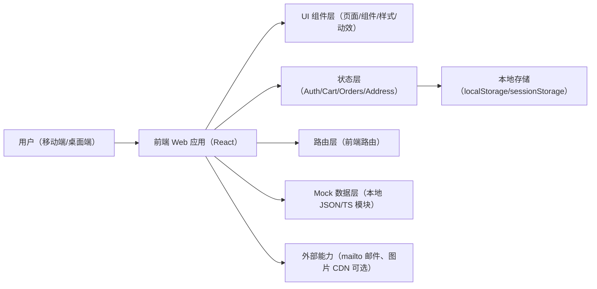
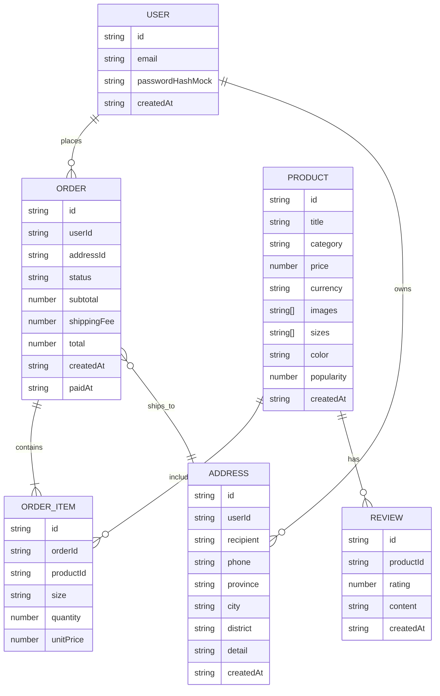

## 1. Architecture Design


## 2. Technology Description
- Frontend: React@18 + TypeScript + Vite
- Styling: Tailwindcss@3（用于布局与细节）+ 少量自定义 CSS（排版、动效、主题变量）
- Routing: React Router（前端路由）
- Forms & Validation: 原生表单 + 轻量校验（不引入重型表单库，除非后续确认需要）
- State: React Context + hooks（购物车/登录态/地址/订单）；关键数据落地 localStorage
- Data: Mock 数据（商品、评价、订单），支付流程为前端 mock
- Icons: 统一线性 icon（优先使用已在生态中常见的 React icon 集；若未引入则使用本地 SVG）

## 3. Route Definitions
| Route | Purpose |
|-------|---------|
| / | 首页（轮播、新品、热销、新用户弹窗） |
| /auth | 注册/登录（邮箱） |
| /products | 商品列表（筛选/排序） |
| /products/:id | 商品详情（图集、尺码、评价、加购） |
| /cart | 购物车 |
| /checkout | 结算（地址、摘要、支付入口） |
| /payment/success | 支付成功（mock） |
| /orders | 历史订单（列表/详情入口） |
| /orders/:id | 订单详情 |
| /contact | 联系我们（邮件方式） |
| /coming-soon | 统一空状态“敬请期待”（可用于未上线入口） |
| * | 404（可同样采用极简空状态） |

## 4. API Definitions
无后端：页面直接使用本地 mock 数据与本地存储状态，不定义网络 API。若后续需要接入真实后端，可按以下方向演进：
- GET /api/products
- GET /api/products/:id
- POST /api/auth/register
- POST /api/auth/login
- POST /api/orders
- GET /api/orders
- GET /api/orders/:id

## 5. Server Architecture Diagram
无后端（本期）。

## 6. Data Model

### 6.1 Data Model Definition


### 6.2 Data Definition Language
本期不落库，使用 TypeScript 类型 + 本地存储序列化。建议的类型骨架：
```ts
export type Product = {
  id: string
  title: string
  category: string
  price: number
  currency: "CNY"
  images: string[]
  sizes: string[]
  color?: string
  popularity?: number
  createdAt: string
}

export type Address = {
  id: string
  recipient: string
  phone: string
  province: string
  city: string
  district: string
  detail: string
  createdAt: string
}

export type OrderStatus = "created" | "paid"

export type OrderItem = {
  id: string
  productId: string
  size: string
  quantity: number
  unitPrice: number
}

export type Order = {
  id: string
  status: OrderStatus
  items: OrderItem[]
  address: Address
  subtotal: number
  shippingFee: number
  total: number
  createdAt: string
  paidAt?: string
}
```

