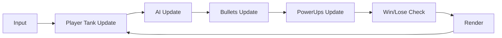

# 技术架构：简化版《坦克大战》（Canvas 单文件）

## 1. 技术栈
- HTML：单页结构、HUD、覆盖层按钮
- CSS：界面样式（复古像素风/街机风）
- JavaScript：纯原生（无依赖），Canvas 2D 渲染
- 数据存储（可选）：`localStorage`（保存/继续）

## 2. 核心模块划分（单文件内分区组织）
1. **配置与常量**
   - 画布尺寸、tile 大小、速度、冷却、敌人总数、掉落规则
   - 难度参数表（easy/normal/hard）
2. **输入系统**
   - `keydown/keyup` 维护按键状态
   - 处理转向最小间隔、射击冷却
3. **世界与地图**
   - 2D 网格地图：`0=空地, 1=砖墙, 2=铁墙, 3=草地`
   - 提供 tile 碰撞查询、砖墙破坏、渲染分层（草地在上层）
4. **实体系统**
   - `Tank`：位置、方向、速度、HP、阵营（玩家/敌人）、射击逻辑
   - `Bullet`：位置、方向、速度、伤害、所属阵营；与 tile/坦克/基地碰撞
   - `PowerUp`：类型（ATK/LIFE）、位置、拾取判定、持续与叠加规则
   - `Base`：固定在底部中央，具备 HP 或一次性摧毁
5. **AI 系统**
   - 敌人行为：随机选择方向，保持一段时间；碰撞/卡住则换向
   - 射击：基于冷却 + 概率触发；限制同屏敌方子弹数（难度参数）
6. **游戏状态机**
   - `menu/playing/win/lose/draw`
   - 管理开始、重试、（可选）继续存档
7. **渲染与特效**
   - 主渲染：背景 → 固体 tile（砖/铁）→ 坦克/子弹 → 草地覆盖 → HUD/覆盖层
   - 可选：爆炸粒子、击中火花（轻量实现）

## 3. 数据流与主循环
- `requestAnimationFrame(loop)`：
  1. 计算 `dt`（毫秒/秒）
  2. 根据输入更新玩家（移动/射击）
  3. 更新敌人 AI（移动/射击/生成）
  4. 更新子弹（移动/碰撞/销毁）
  5. 更新道具（生成/拾取/计时）
  6. 胜负判定（击杀数/生命/基地）
  7. 渲染画面与 HUD

## 4. 碰撞策略
- 坦克碰撞：AABB 与 tile 网格检测（按移动轴分离，先 X 后 Y 或反之）
- 子弹碰撞：子弹点/小 AABB 与 tile/坦克 AABB
- 砖墙破坏：命中 tile 直接置空；铁墙命中则子弹停止（或反弹：方向取反并衰减一次）
- 草地：不参与碰撞；渲染时覆盖于坦克之上以实现“遮挡视线”

## 5. 道具规则（实现口径）
- **攻击提升（ATK）**：提升玩家子弹速度/射速或伤害，持续 `N` 秒；不叠加，重复拾取仅刷新持续时间
- **生命增加（LIFE）**：玩家生命 +1（可叠加），可设置上限以控制难度

## 6. 可选特性实现建议
- 局时限制：在 `playing` 状态维护倒计时；到 0 切换 `draw`
- 存档：定期或手动将 `{difficulty, lives, kills, enemiesSpawned, mapState, atkBuffLeft}` 序列化到 `localStorage`
- 难度：通过参数表影响 `enemySpeed / fireCooldown / spawnInterval / maxEnemyBullets`

## 7. 性能与兼容性
- 目标：60 FPS；避免每帧创建大量对象（子弹/粒子可复用或限制数量）
- 兼容：现代桌面浏览器（Chrome/Edge/Firefox/Safari）

