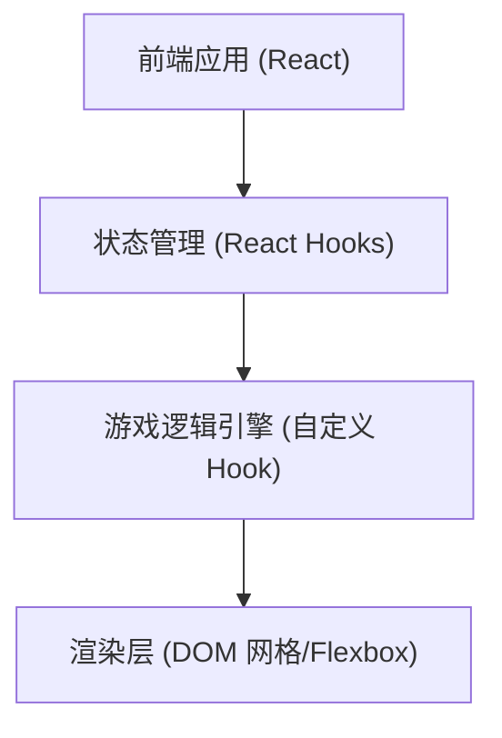

## 1. 架构设计



## 2. 技术说明
- **前端框架**: React@18
- **构建工具**: Vite
- **样式方案**: TailwindCSS@3 + 原生 CSS (用于发光效果和动画)
- **游戏渲染**: 使用 React 组件渲染二维网格，通过状态更新驱动视图变化，便于实现响应式和灵活的样式定制。

## 3. 路由定义
单页应用，使用基本组件切换。
| 路由 | 目的 |
|-------|---------|
| / | 游戏主页面，包含计分板和游戏区域 |

## 4. API 定义
本应用无需后端服务，所有数据存储在本地内存或 `localStorage`（用于最高分）。

## 5. 核心状态定义
```typescript
type Direction = 'UP' | 'DOWN' | 'LEFT' | 'RIGHT';
type Position = { x: number; y: number };
type GameStatus = 'IDLE' | 'PLAYING' | 'PAUSED' | 'GAME_OVER';

interface GameState {
  snake: Position[];
  food: Position;
  direction: Direction;
  status: GameStatus;
  score: number;
  highScore: number;
}
```

## 6. 数据模型
游戏数据持久化使用 `localStorage`。

### 6.1 数据结构
```json
{
  "snake_high_score": 100
}
```
