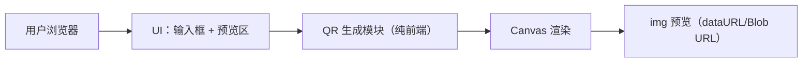

# 技术架构：极简在线二维码生成工具

## 1. 架构概览

目标是一个“纯前端、无后端依赖”的静态网页应用：

- 单页应用（不需要路由）
- 前端本地生成二维码（canvas → PNG）
- 不存储输入内容，不上传网络请求

## 2. 技术选型

### 2.1 运行形态

- 静态资源：HTML + CSS + 原生 JavaScript（ESM 可选）
- 部署：任意静态托管（Nginx / GitHub Pages / Vercel Static / OSS）

选择原生方案的原因：

- 体积小、加载快
- 不需要构建工具也可运行
- 更利于“极简”和“匿名”

### 2.2 二维码生成库策略

要求：离线生成、可控像素级绘制、许可证友好。

推荐做法（优先级从高到低）：

1) 直接内置一个小型、纯 JS 的 QR 生成实现（例如基于公开实现的 qrcode generator），避免外链与包管理依赖  
2) 如果后续引入构建链，则使用成熟 npm 包（例如 `qrcode`）并做 tree-shaking

输出策略：

- 先得到二维码模块矩阵（boolean/bit matrix）
- 使用 canvas 按整数倍像素绘制（避免缩放导致模糊）
- 导出 `canvas.toDataURL("image/png")`，赋值给 ``

## 3. 目录结构（建议）

若采用纯静态方案：

- `index.html`
- `assets/`
  - `styles.css`
  - `app.js`
  - `qr/`（二维码生成实现，或第三方库源码）

## 4. 关键模块设计

### 4.1 输入与防抖

- 监听 `input` 事件
- 监听 `paste` 事件（可立即触发一次生成）
- 防抖定时器：默认 1000ms
- 边界：
  - 空字符串：清空预览，显示占位状态
  - 超长：显示提示并停止生成，避免卡顿

### 4.2 生成与渲染

渲染参数建议：

- `sizePx`: 320（桌面）/ 256（移动）
- `marginModules`: 4（quiet zone）
- `errorCorrection`: M（默认），在内容较短时可提升至 Q

渲染算法要点：

- 计算每个 module 的像素大小 `scale = floor(sizePx / (modules + 2*marginModules))`
- 画布实际尺寸 `canvas.width = canvas.height = scale * (modules + 2*marginModules)`
- 先铺白底，再绘制黑块，避免透明背景影响识别

### 4.3 预览与保存

- `` 展示生成后的 PNG（dataURL 或 Blob URL）
- 右键保存：浏览器原生支持（img 元素即可）
- 可选增强：提供一个显式“下载 PNG”链接（`download` 属性），但不作为主流程按钮

## 5. 响应式布局策略

- 桌面优先：两栏布局（输入左，预览右）
- 窄屏：单栏纵向（输入上，预览下）
- CSS 实现：`grid` 或 `flex`，使用媒体查询在 768px 断点切换

## 6. 安全与隐私

- 不发送网络请求（除静态资源加载外）
- 不落盘：不写 localStorage/cookie，不做历史记录
- 不拼接 HTML：避免 XSS
- 不记录日志：不输出用户输入到 console

## 7. 可测试性与验收

手工测试用例：

- 粘贴 `https://example.com`：1 秒内生成，可扫码
- 输入中文与空格换行：可扫码
- 清空输入：预览回到占位
- 输入超长文本：显示“内容过长”并不生成
- 右键二维码图片：可保存 PNG，并可在本地打开查看

可选自动化：

- 单元测试：对“防抖触发”和“渲染尺寸计算”进行纯函数测试
- E2E：Playwright 验证生成后 img `src` 非空、尺寸合理

