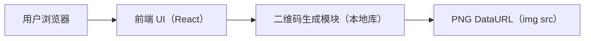

# 极简在线二维码生成器（匿名版）技术架构

## 1. Architecture Design
纯前端静态站点，无后端、无账号体系、无数据存储；二维码在浏览器本地生成 PNG DataURL 并以 `` 显示。

## 2. Technology Description
- Frontend: React@18 + Vite（TypeScript）
- Styling: CSS Modules 或原生 CSS（避免引入过重依赖；以少量 CSS 变量实现主题）
- QR: 前端二维码生成 npm 库（支持生成 PNG DataURL、可配置纠错级别与尺寸）
- Backend: None
- Deployment: 任意静态托管（Vercel/Netlify/GitHub Pages/Nginx）

## 3. Route Definitions
| Route | Purpose |
|-------|---------|
| / | 输入内容并自动生成二维码、预览与保存 |

## 4. API Definitions (if backend exists)
不适用。

## 5. Server Architecture Diagram (if backend exists)
不适用。

## 6. Data Model (if applicable)
不适用（不持久化、不上传、不记录用户输入）。

### 6.1 Data Model Definition
不适用。

### 6.2 Data Definition Language
不适用。

## 7. Non-Functional Requirements
- 性能：首屏快速加载；输入防抖避免频繁计算；生成过程保持流畅
- 可用性：无需按钮即可生成；空输入与错误时给出明确反馈
- 可访问性：输入框有清晰 label；对比度达标；键盘可用
- 安全：不发起网络请求、不记录输入；不将用户输入插入 HTML；避免在日志中输出用户内容

