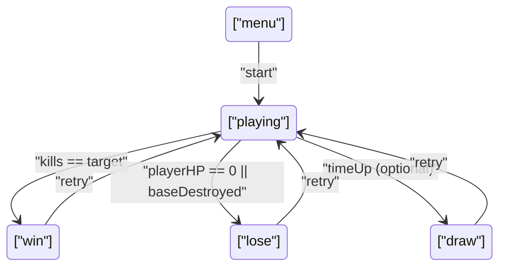

# 技术架构：简化版“坦克大战”（单文件 Canvas）

## 1. 技术选型
- 渲染：Canvas 2D
- 运行形态：单文件 index.html（内嵌 CSS 与 JS）
- 资源：尽量使用程序化绘制（矩形/线条），避免外部图片依赖

## 2. 核心模块划分（在一个 JS 作用域内组织）
1. 常量与配置
   - tileSize、地图宽高、速度、冷却、敌人总数、最大同时敌人数
2. 输入系统
   - 键盘状态表（keydown/keyup）
   - 动作映射：移动向量、射击触发（按冷却节流）
3. 游戏状态机
   - "menu" | "playing" | "win" | "lose" | "draw"
   - reset() / start() / end(state)
4. 地图系统（TileMap）
   - 二维数组：0 空地、1 砖、2 铁、3 草、4 基地
   - 查询：getTile(tx,ty)、setTile(tx,ty,val)
   - 碰撞：rectVsSolidTiles(rect)（砖/铁/基地视为实体，草不算）
5. 实体系统（Entities）
   - Tank：position、dir、speed、hp、team、cooldowns、aiState
   - Bullet：position、vel、team、damage、ttl
   - PowerUp：type、position、ttl
6. 物理与碰撞
   - AABB 碰撞（矩形/点）
   - 坦克移动：轴分离（先 X 后 Y）+ 碰撞回退/阻挡
   - 子弹更新：逐帧位移 + 碰撞检测（墙/坦克/基地）
7. AI 控制器
   - 定时决策：随机换向、射击尝试
   - 遇阻换向：如果移动受阻则选择新方向
8. 渲染与层级
   - 背景/地形层：空地、砖、铁、基地
   - 实体层：坦克、子弹、道具
   - 草地遮挡层：草地最后绘制以“遮挡视线”
   - HUD/遮罩：文本 + 半透明结束面板
9. 计时与循环
   - requestAnimationFrame 主循环
   - deltaTime（ms）驱动移动与冷却
   - 可选 3 分钟倒计时开关

## 3. 数据模型
### 3.1 TileMap
- map: number[][]（行列）
- width/height（tile 计数）
- tileSize（像素）

### 3.2 Tank
- x, y（像素，左上角）
- w, h（像素）
- dir: "up" | "down" | "left" | "right"
- team: "player" | "enemy"
- hp（玩家可 >1；敌人可 1 或 2）
- fireCooldownMs（射击冷却）
- moveSpeed（与难度相关）
- ai（仅敌方）：nextTurnAt、nextFireAt、stuckFrames 等

### 3.3 Bullet
- x, y, r（半径）
- vx, vy（速度）
- team（用于友军/敌军伤害过滤）
- damage（受攻击提升影响）
- ttlMs（防止永远存在）

### 3.4 PowerUp
- type: "atk" | "life"
- x, y, r
- ttlMs

## 4. 状态与流程

## 5. 碰撞与规则实现细节
- 坦克 vs 墙：
  - solidTiles = {砖, 铁, 基地}
  - grass 不算实体；渲染层级用于遮挡效果
- 子弹 vs 砖：
  - 命中后 setTile(砖->空)；子弹消失
- 子弹 vs 铁：
  - 不穿透：默认实现为“子弹消失”；可选“反弹一次后消失”
- 子弹 vs 基地：
  - 命中触发 baseDestroyed=true，进入 lose
- 子弹 vs 坦克：
  - team 不同才生效
  - 敌人 hp 归零：killCount++，并触发掉落逻辑

## 6. 道具系统与规则
- 掉落触发：
  - 方案 A（推荐）：精英敌人（spawn 时标记 elite）必掉
  - 方案 B：按概率掉落
- 效果：
  - "life"：playerHP += 1（可设上限）
  - "atk"：进入 buff 状态：damageMultiplier=2；持续 durationMs；重复拾取刷新剩余时间（不叠加倍数）
- UI：
  - HUD 显示 buff 剩余时间与倍率

## 7. 难度参数（可选）
- easy: enemySpeed=0.8, enemyFireCd=900ms, maxEnemiesOnField=2
- normal: enemySpeed=1.0, enemyFireCd=700ms, maxEnemiesOnField=3
- hard: enemySpeed=1.2, enemyFireCd=520ms, maxEnemiesOnField=4

## 8. 性能与可维护性
- 单画布重绘：每帧清屏并重绘所有层
- 对象池可选：子弹数量较少时无需
- 纯函数工具：AABB/网格转换，避免隐式依赖

