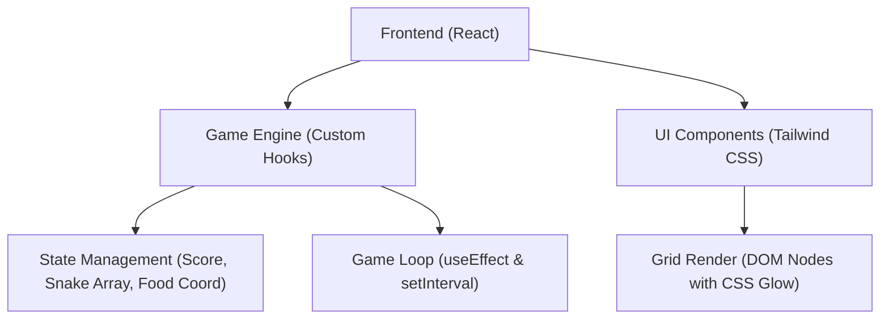

# 技术架构文档 (Technical Architecture)

## 1. 架构设计


## 2. 技术说明
- **前端框架**: React 18 + TypeScript + Vite
- **样式方案**: Tailwind CSS (用于快速布局和响应式设计) + 原生 CSS (用于霓虹发光动效、字体和特殊动画)
- **游戏渲染**: 基于 React 的网格渲染 (DOM based)。通过 CSS Grid 绘制 20x20 的游戏网格，利用 DOM 节点配合 CSS box-shadow 实现极具视觉冲击力的发光效果。
- **状态管理**: 
  - `useState` 和 `useRef` 管理游戏循环、蛇身坐标数组、方向、食物坐标。
  - `useCallback` 优化键盘事件监听器。
- **持久化**: 使用 `localStorage` 存储历史最高分。

## 3. 路由定义
单页面应用，无复杂路由。
| 路由 | 目的 |
|-------|---------|
| / | 游戏主页，包含所有功能 |

## 4. 数据模型
核心游戏状态数据结构：
```typescript
type Point = { x: number; y: number };
type GameState = 'IDLE' | 'PLAYING' | 'PAUSED' | 'GAME_OVER';
type Direction = 'UP' | 'DOWN' | 'LEFT' | 'RIGHT';
```
