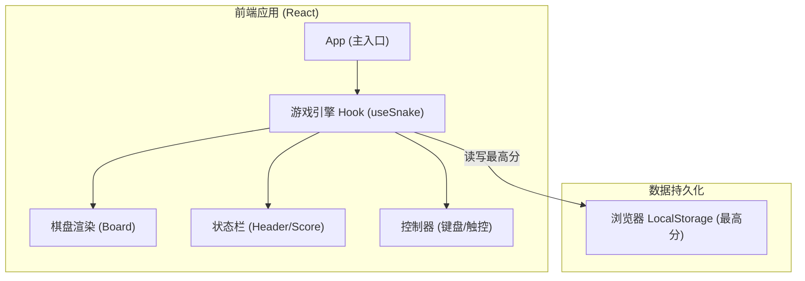

## 1. 架构设计
纯客户端单页应用（SPA），游戏状态全部在本地内存及 LocalStorage 中管理。

## 2. 技术说明
- **前端框架**: React@18 + TypeScript + Vite
- **样式方案**: Tailwind CSS 3 + 自定义 CSS Variables (用于发光与霓虹效果)
- **状态管理**: React Hooks (`useState`, `useEffect`, `useCallback`, `useRef`) 
- **图标库**: Lucide React
- **持久化**: LocalStorage API 存储历史最高得分
- **工具库**: `clsx`, `tailwind-merge` 用于类名合并与动态样式

## 3. 路由定义
| 路由 | 目的 |
|-------|---------|
| `/`   | 游戏主页，包含所有核心交互 |

## 4. 核心逻辑实现
- **网格系统**：使用二维坐标系 `(x, y)` 表示位置。例如定义 `20x20` 的网格。
- **蛇身状态**：使用数组存储坐标，`[{x: 5, y: 5}, {x: 4, y: 5}]`。数组首位为蛇头。
- **游戏循环**：使用 `useEffect` 结合 `setInterval`，或利用 `requestAnimationFrame` 配合时间差控制帧率（例如每 150ms 移动一格）。随着得分增加，可适当缩短间隔以增加难度。
- **碰撞检测**：
  - **墙壁碰撞**：判断蛇头坐标是否超出网格边界 `0` 到 `WIDTH-1`，`0` 到 `HEIGHT-1`。
  - **自身碰撞**：判断蛇头坐标是否与蛇身数组的其余坐标重合。
- **防止反向掉头**：使用 `useRef` 记录上一个合法移动方向，确保按键切换方向时不会直接导致与上一个移动方向相反（比如正在向右移动时，按左键应该无效）。
