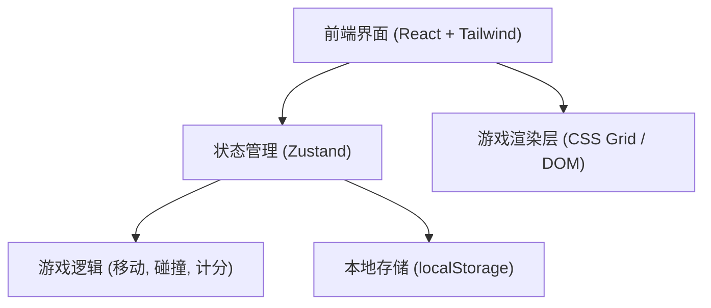
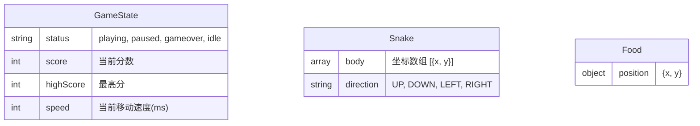

## 1. 架构设计

## 2. 技术说明
- **前端框架**：React@18 + tailwindcss@3 + vite
- **初始化工具**：vite-init (使用 `react-ts` 模板)
- **状态管理**：Zustand（轻量级，适合管理蛇的坐标、方向、食物坐标、分数、游戏状态）
- **游戏引擎**：基于 React 状态驱动的 `useEffect` 和 `setInterval` 循环。
- **渲染方式**：采用 CSS Grid 渲染，每个网格单元格对应一个状态。利用 Tailwind CSS 提供的阴影 (drop-shadow / box-shadow) 实现强烈的霓虹发光效果，保证性能与开发效率。

## 3. 路由定义
| 路由 | 用途 |
|-------|---------|
| `/` | 游戏主页，包含完整游戏体验 |

## 4. 数据模型 (前端状态模型)

