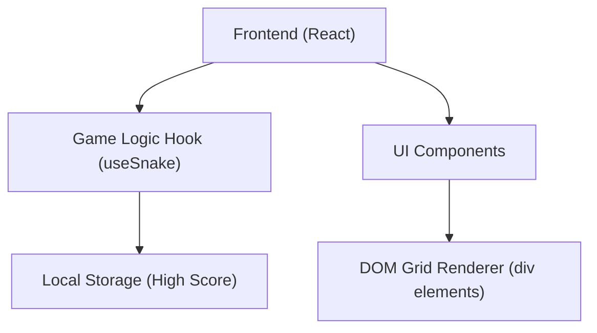

## 1. 架构设计



## 2. 技术说明
- **前端框架**: React@18 + TypeScript
- **样式方案**: TailwindCSS@3 + 自定义 CSS (用于霓虹发光特效与平滑动画)
- **构建工具**: Vite
- **状态管理**: React Hooks (`useState`, `useEffect`, `useCallback`, `useRef`)
- **渲染方式**: 基于 DOM (CSS Grid) 的渲染方案。使用 `div` 渲染每个网格单元，更容易实现赛博朋克发光、圆角等精美 CSS 效果，同时避免 Canvas 绘制在高清屏下的模糊问题。

## 3. 路由定义
| 路由 | 目的 |
|------|------|
| `/` | 游戏主页（单页应用，无多路由需求） |

## 4. 数据模型 (本地存储)
- **High Score**: 存储于 `localStorage.getItem('snakeHighScore')`，类型为 `number`。

### 4.1 游戏状态类型定义
```typescript
type Position = { x: number; y: number };
type Direction = 'UP' | 'DOWN' | 'LEFT' | 'RIGHT';
type GameStatus = 'IDLE' | 'PLAYING' | 'PAUSED' | 'GAME_OVER';

interface GameState {
  snake: Position[];
  food: Position;
  direction: Direction;
  status: GameStatus;
  score: number;
  highScore: number;
}
```
