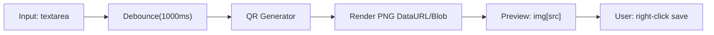

# Technical Architecture：极简在线二维码生成工具

## 1. 架构概览
目标是一个可静态部署的纯前端应用：不依赖登录、不需要服务端、无需数据库。二维码在浏览器内生成，输入内容不出本地。

**关键点**
- 纯前端生成二维码（Canvas/SVG → PNG）
- debounce 控制生成频率
- 生成结果以 `img` 展示以满足右键保存
- 不存储用户输入（默认不使用 localStorage）

## 2. 技术选型（建议）
第一版以“体积小 + 上手快 + 可静态部署”为原则。

**构建与语言**
- 构建：Vite
- 语言：TypeScript（或 JS；若团队偏好 JS 可降级）

**二维码库**
- 使用成熟的二维码生成库（NPM 依赖，随构建打包）
- 需要能力：
  - 生成 Canvas 或直接生成 PNG data URL
  - 支持纠错等级（至少 M）
  - 支持 UTF-8 文本

**渲染方式**
- 推荐：生成 `data:image/png;base64,...` 或 `Blob URL`，赋给 `img.src`
- 备选：直接渲染 `<canvas>`，但右键保存体验在不同浏览器上不一致；因此仍建议最终导出为 `img`

## 3. 目录结构（建议）
```text
/
  index.html
  src/
    main.ts
    app.ts
    styles.css
    qr/
      generate.ts
    ui/
      dom.ts
      state.ts
  public/
```

## 4. 运行时数据流


**步骤**
1. 监听 `input` 事件，更新内存态 `currentText`
2. 使用 debounce（1s）触发生成任务
3. 生成任务：
   - 空字符串：清空预览区，显示空态
   - 非空：调用二维码库生成 PNG（推荐带 quiet zone）
4. 更新预览 `img.src`，并更新可访问性状态（错误/完成）

## 5. 关键实现细节
**Debounce**
- 使用 `setTimeout` 实现 1000ms debounce
- 在新输入到来时取消上一次定时器

**二维码参数**
- `errorCorrectionLevel`: `"M"`（默认）
- `margin`: `2` 或 `4`（保证静区）
- `width`: 根据容器尺寸自适应（例如 256–320，移动端按 viewport 缩放）
- 颜色：前景纯黑 `#000`，背景纯白 `#fff`（第一版）

**输出**
- 优先输出 PNG：
  - 若库提供 `toDataURL`：直接生成
  - 若库返回 canvas：使用 `canvas.toDataURL("image/png")`

**内存与性能**
- 避免每次生成都创建大量 DOM 节点；复用同一个 `img`
- 若使用 `Blob URL`，更新前 `URL.revokeObjectURL(oldUrl)`

## 6. 安全与隐私
**隐私**
- 不发起网络请求上传内容
- 不在 URL query/hash 中写入输入内容（避免泄露）
- 不写入 localStorage（默认）

**安全**
- 不把输入内容当作 HTML 注入页面
- 如后续添加分享链接功能，需要明确告知并默认关闭

**部署安全建议（可选）**
- 配置基础 CSP（确保不允许不必要的脚本来源）

## 7. 可访问性
- 输入框使用 `<label for>` 绑定
- 状态提示使用 `aria-live="polite"`
- 按钮（如清空）具备可读文本或 aria-label

## 8. 测试与验收（建议）
**手动验收用例**
- 粘贴 `https://example.com`：1s 内生成可扫码
- 输入中文/换行：可扫码，内容一致
- 清空输入：二维码消失，显示空态
- 移动端竖屏：布局上下排列，二维码居中且不溢出
- 右键保存：保存为 PNG，图片清晰

**自动化（可选）**
- 单元测试 debounce 与状态机（若采用 TS/模块化）
- 端到端：Playwright 基本流程（输入→出现 img）

