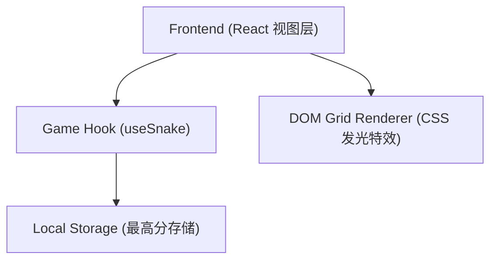

## 1. 架构设计

## 2. 技术说明
- **前端框架**：React@18 + TailwindCSS@3 + Vite
- **状态管理**：React Hooks (useState, useEffect, useRef, useCallback)
- **渲染方式**：由于贪吃蛇对性能要求适中且我们要加入霓虹和发光特效，直接采用 DOM 元素 + CSS Grid 的方式进行渲染，能更方便地利用 TailwindCSS 快速实现视觉效果。
- **构建工具**：Vite（快速本地开发）
- **图标**：Lucide React（用于界面按钮图标）

## 3. 路由定义
| 路由 | 目的 |
|-------|---------|
| `/` | 游戏主页面（单页应用，无需多路由） |

## 4. API 定义
纯前端游戏，无后端 API。

## 5. 服务器架构图
无。

## 6. 数据模型
### 6.1 本地存储数据模型
存储在浏览器的 `localStorage` 中的数据：
- `snake_highest_score`: `number` 类型，记录玩家的历史最高得分。

### 6.2 游戏核心状态 (State Model)
- `snake`: `Array<{x: number, y: number}>` (蛇身坐标数组)
- `food`: `{x: number, y: number}` (食物坐标)
- `direction`: `{x: number, y: number}` (当前移动方向向量)
- `status`: `'idle' | 'playing' | 'paused' | 'gameover'` (游戏状态枚举)
- `score`: `number` (当前得分)
- `speed`: `number` (蛇移动时间间隔，毫秒)
