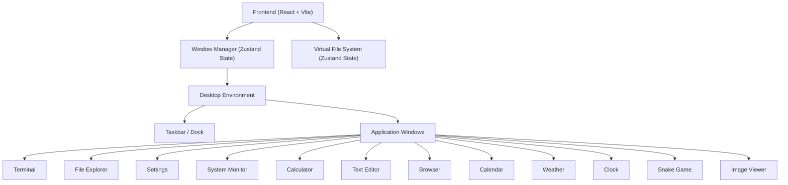
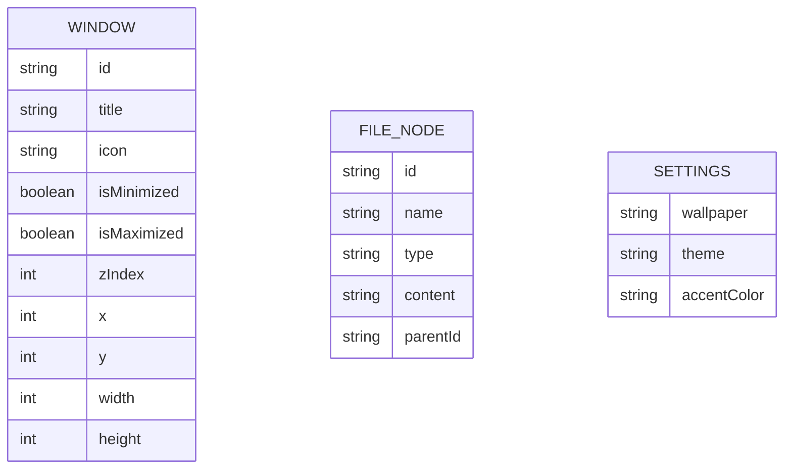

## 1. Architecture Design

## 2. Technology Description
- Frontend: React@18 + tailwindcss@3 + vite + zustand (for global state) + framer-motion (for smooth window transitions, minimizing animations) + react-rnd (for resizable/draggable windows).
- Initialization Tool: vite
- Icons: lucide-react
- State Management: Zustand (Window state, Z-index management, Virtual File System, System Settings).
- Styling: Tailwind CSS, Custom CSS for specific desktop aesthetics (glassmorphism, gradient meshes).

## 3. Route Definitions
| Route | Purpose |
|-------|---------|
| / | Desktop Environment Home |

## 4. API Definitions (if backend exists)
No backend. All state is held in memory and persisted in `localStorage` for the virtual file system and user settings.

## 5. Server Architecture Diagram (if backend exists)
Not applicable (Client-side only).

## 6. Data Model (if applicable)
### 6.1 Data Model Definition

### 6.2 Data Definition Language
Data is managed via Zustand stores and serialized to localStorage.
- `useWindowStore`: Manages the state of currently open windows, stacking order, and positions.
- `useFileSystemStore`: Manages tree of `FILE_NODE` objects.
- `useSettingsStore`: Manages wallpaper, theme, and user preferences.