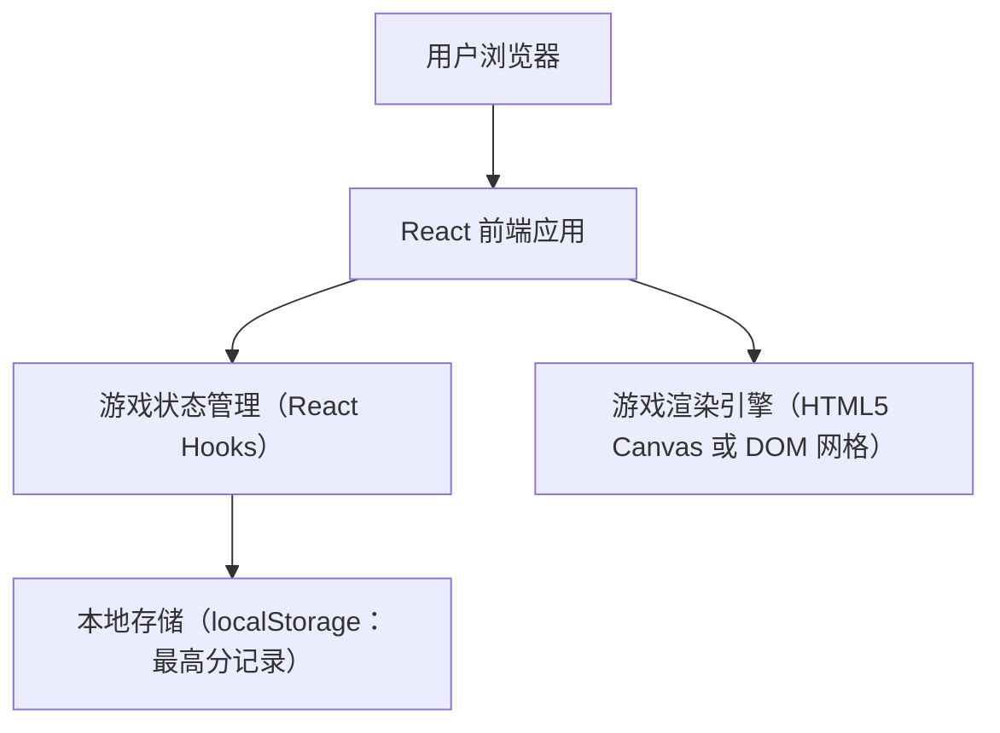
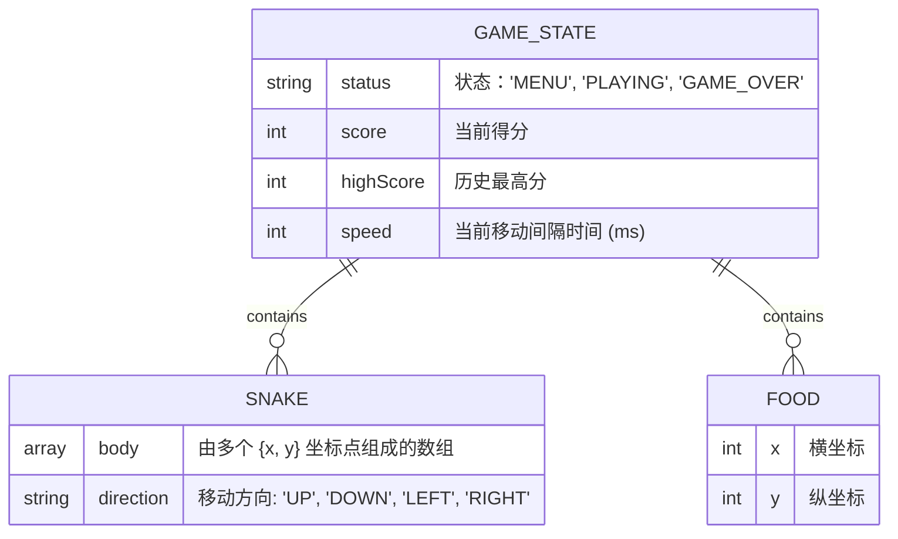

## 1. 架构设计

## 2. 技术说明
- **前端框架**: React@18 + tailwindcss@3 + vite
- **UI 风格组件**: Tailwind CSS + 纯 CSS 动画（霓虹发光效果、呼吸灯）
- **图标与字体**: 使用 Google Fonts（如 Orbitron，Press Start 2P 等）和 lucide-react 图标。
- **游戏渲染方式**: 使用 CSS Grid 构建二维网格系统，配合 React 状态驱动蛇的位置和食物的生成（适合实现现代发光特效和 CSS 动画）。
- **初始化工具**: vite-init 或 npm create vite@latest

## 3. 路由定义
由于是单页纯前端休闲游戏，无需复杂路由配置。
| 路由 | 用途 |
|-------|---------|
| `/` | 游戏唯一入口（包含开始、游玩、结算等视图组件的切换） |

## 4. API 定义
纯前端本地游戏，无后端 API。状态通过 React useState 和 useReducer/useRef 进行管理。

## 5. 数据模型
主要在本地维护的复杂状态数据。

### 5.1 状态模型定义

### 5.2 核心 Hook 设计
使用 `useGameLoop` Hook 管理 `requestAnimationFrame` 或 `setInterval` 的游戏循环，结合 `useRef` 保存最新方向，以避免 React 闭包带来的状态过期问题。
包含 `moveSnake`, `checkCollision`, `eatFood`, `resetGame` 等核心方法。
