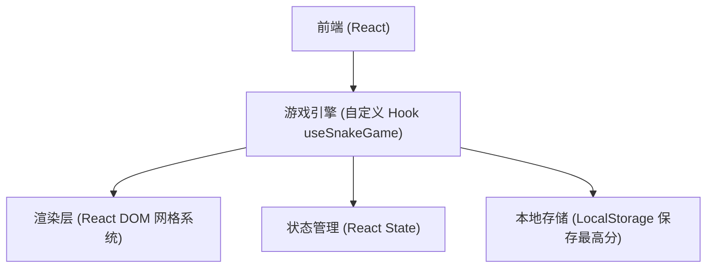
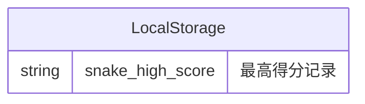

## 1. 架构设计


## 2. 技术说明
- 前端框架：React 18 + TypeScript + Vite
- 样式方案：Tailwind CSS + Lucide React (图标)
- 游戏渲染：使用 React 状态驱动的网格系统。DOM 网格结合 Tailwind 易于实现精确的网格控制和发光 (`shadow`) 效果。
- 状态管理：使用 React `useState`, `useEffect`, `useCallback`, `useRef` 实现游戏循环 (requestAnimationFrame 或 setInterval)。
- 数据持久化：使用浏览器 `localStorage` 保存并读取最高分。

## 3. 路由定义
| 路由 | 用途 |
|------|------|
| `/` | 唯一的游戏主界面 |

## 4. API 定义
纯前端单机游戏，无后端 API 交互。

## 5. 服务端架构图
不适用。

## 6. 数据模型

### 6.1 数据模型定义


### 6.2 核心数据结构 (TypeScript)
```typescript
type Point = { x: number; y: number };
type Direction = 'UP' | 'DOWN' | 'LEFT' | 'RIGHT';

interface GameState {
  snake: Point[];      // 蛇身坐标数组
  food: Point;         // 食物坐标
  direction: Direction;// 当前运动方向
  status: 'IDLE' | 'PLAYING' | 'PAUSED' | 'GAME_OVER'; // 游戏状态
  score: number;       // 当前得分
  highScore: number;   // 最高得分
}
```
