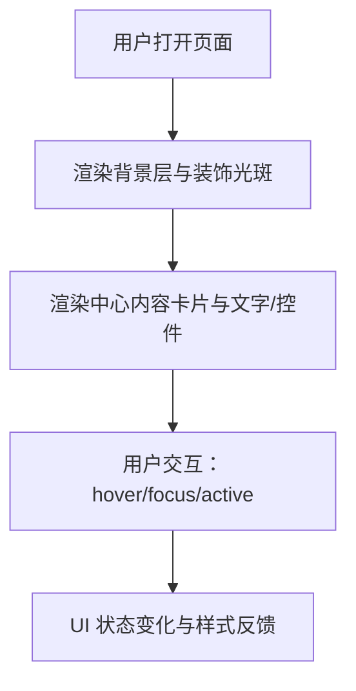

## 1. 产品概述
基于用户提供的截图，100% 还原对应的 Web 页面 UI（纯前端实现）。
目标是实现像素级外观一致、交互一致、可在现代浏览器稳定渲染的静态页面/组件。

## 2. 核心功能

### 2.1 功能模块
1. **UI 还原页**：背景氛围（渐变/光斑/纹理）、中心内容卡片（玻璃拟态）、文本与控件（按钮/表单/列表等）完整复刻。
2. **交互与状态**：hover/active/focus、按钮主次态、输入/选择等基础交互状态还原（如截图可见）。

### 2.2 页面明细
| 页面名称 | 模块名称 | 功能描述 |
|---|---|---|
| UI 还原页 | 背景层 | 深色底 + 渐变光斑/模糊色块 + 细微噪点纹理（如截图） |
| UI 还原页 | 内容卡片 | 居中卡片，圆角、描边、高光、阴影、模糊背景（玻璃拟态） |
| UI 还原页 | 文本层级 | 标题/副标题/说明文字/标签等字号、字重、行高、颜色、间距按截图还原 |
| UI 还原页 | 控件与布局 | 按截图出现的按钮/输入框/选项区等，包含正常/hover/focus/disabled 等状态 |

## 3. 核心流程
用户打开页面，即看到与截图一致的 UI；可进行基础交互（聚焦输入、悬停按钮等），界面状态变化与设计一致。

## 4. 用户界面设计

### 4.1 设计风格
- 主色：深色（近黑/深紫）背景 + 紫/蓝/粉的霓虹渐变点缀（以截图为准）
- 卡片：玻璃拟态（半透明底色、背景模糊、细描边、高光与投影）
- 字体：标题使用更具展示感的无衬线字体，正文使用易读无衬线字体；字号/字重/字距按截图精确匹配
- 布局：居中单卡片为主，留白精确控制；按钮与控件采用圆角胶囊/圆角矩形（以截图为准）
- 动效：轻微的入场淡入/上移；hover/focus 使用柔和发光与阴影过渡（不影响像素级布局）

### 4.2 页面设计概览
| 页面名称 | 模块名称 | UI 元素 |
|---|---|---|
| UI 还原页 | 背景层 | 纯色底、径向渐变、模糊光斑、噪点纹理、暗角 |
| UI 还原页 | 卡片 | 圆角、描边、内高光、投影、backdrop-filter |
| UI 还原页 | 内容区 | 标题/说明文、分隔线、表单/列表区域（按截图） |
| UI 还原页 | 按钮 | 主按钮（强调色/渐变）+ 次按钮（低对比/描边） |

### 4.3 响应式
桌面优先实现；在窄屏下保持卡片居中与比例不变，必要时缩放/换行以保证与截图一致的视觉密度。
