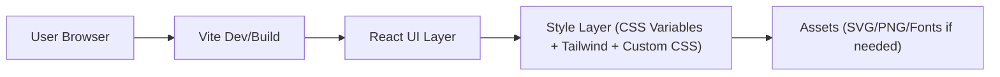

## 1. 架构设计

## 2. 技术说明
- Frontend: React@18 + Vite + TypeScript
- Styling: tailwindcss@3（用于基础布局与原子类）+ 少量定制 CSS（用于玻璃拟态、噪点纹理、复杂渐变与精确像素控制）
- Initialization Tool: Vite（React + TS 模板）
- Backend: None
- Data: None（静态 UI；如需演示状态使用本地 mock state）

## 3. 路由定义
| Route | Purpose |
|---|---|
| / | 单页 UI 还原展示（与截图一致） |

## 4. API 定义
无（纯前端静态 UI）。

## 5. 目录建议
- src/pages/ReplicaPage.tsx：页面骨架与布局
- src/components/ReplicaCard.tsx：中心卡片组件（可复用）
- src/styles/theme.css：CSS 变量、渐变/纹理工具类与关键帧动画
- src/assets/*：可选的图标/SVG（仅在截图需要时引入）

## 6. 关键实现要点（用于像素级还原）
- 使用 CSS 变量统一颜色与阴影，确保可重复调参到截图一致
- 背景光斑使用多层 radial-gradient + blur/opacity 叠加，并配合暗角
- 卡片玻璃拟态使用半透明填充 + 细描边 + 内外阴影 + backdrop-filter
- 字体与排版通过精确的 font-size/line-height/letter-spacing/spacing 逐项校准
- 交互态通过 :hover/:active/:focus-visible 严格对齐截图的反馈（不改变布局）
