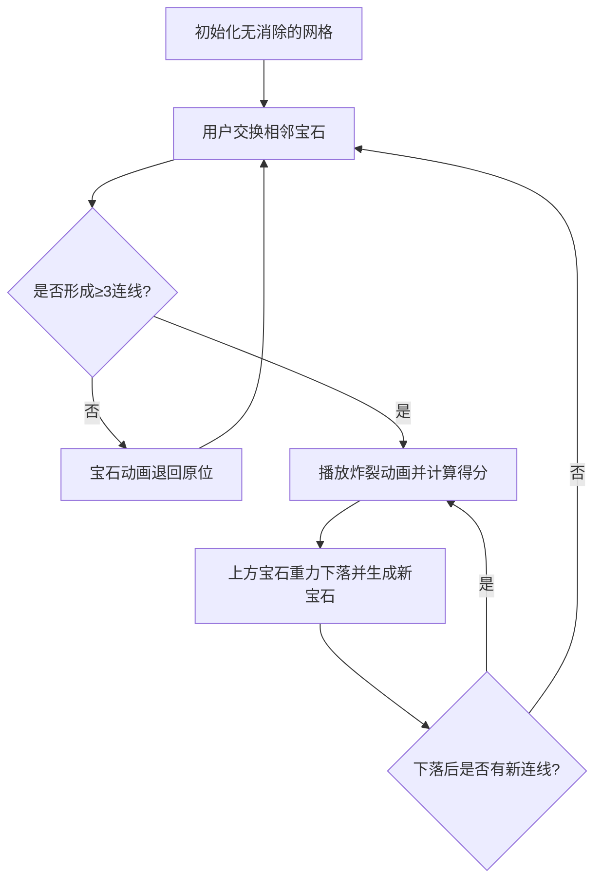
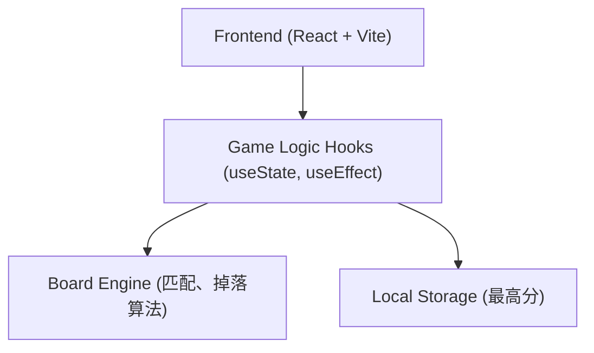

# 玻璃质感果汁消消乐 (Glassmorphism Juicy Match-3) Spec

## Why
用户需要一款基于Web的消消乐游戏。传统的网页消消乐游戏在视觉上千篇一律，我们希望打造一款具有“玻璃质感 (Glassmorphism)”和“果汁感 (Juicy)”的现代化、高美感的网页游戏。通过极致的动画和视觉反馈，提供令人上瘾的游玩体验。

## What Changes
- 全新创建一个基于 React 18 的消消乐网页游戏。
- 引入暗色玻璃质感UI、霓虹发光方块和细腻的物理/消除动画，告别廉价的AI生成感。

## Impact
- Affected specs: 新增游戏主流程、分数系统、消除逻辑。
- Affected code: 全新项目，涉及所有的React组件、状态管理和样式系统。

## ADDED Requirements

### 1. 产品概述
构建一款具有高级美感、响应式设计的消消乐网页应用，核心目标是提供极其丝滑的消除体验和令人惊艳的视觉反馈。该游戏需要注重微交互和高颜值的界面排版。

### 2. 核心功能与流程
#### 2.1 游戏机制
- **网格系统**：8x8 的游戏面板。
- **元素类型**：6种不同颜色/形状的发光宝石（例如：粉红圆、蓝方、绿三角、黄星、紫菱形、橙六边形）。
- **交互方式**：点击或拖拽相邻宝石进行交换。如果交换后无法形成3个以上的连线，则宝石退回原位。
- **消除判定**：横向或纵向连续3个及以上相同宝石即可消除。
- **重力下落**：宝石消除后，上方宝石自然掉落填补空缺，顶部生成新宝石。触发连环消除（Combo）。
- **分数系统**：基础消除得分，Combo有额外倍数加成。

#### 2.2 核心流程图

### 3. 用户界面设计 (User Interface Design)
#### 3.1 设计风格 (Design Style)
- **主题**：暗色玻璃质感 (Dark Glassmorphism)。深邃的动态背景（如暗夜紫到深蓝的缓慢流动渐变动画）。
- **主色调**：深邃紫 `#1a1025`、深蓝 `#0d1b2a`。
- **元素风格**：3D感、带霓虹光晕效果的高饱和度宝石。面板采用半透明磨砂玻璃效果 (`backdrop-filter: blur()`, 白色透明度边框)。
- **排版**：分数和提示文字使用现代化无衬线字体（如 Inter 或特制展示字体），字重采用大胆的 ExtraBold，配合发光阴影效果。
- **动效 (Motion)**：必须使用 Framer Motion 实现丝滑的交换、消除炸裂特效、分数飘字、方块下落的弹簧效果 (spring physics)。这对于游戏的手感至关重要。

#### 3.2 页面模块
| 页面名称 | 模块名称 | 功能描述与 UI 元素 |
|-----------|-------------|---------------------|
| 主页 (Home) | 顶部计分板 | 展示当前分数、最高分、连击倍数。发光的大字体。 |
| 主页 (Home) | 游戏核心面板 | 居中的 8x8 磨砂玻璃质感面板，内部排列发光宝石。 |
| 主页 (Home) | 底部控制区 | 包含重新开始按钮（具备悬浮发光交互），以及简洁的游戏规则说明。 |

#### 3.3 响应式设计
- **Desktop-first**，并对移动设备进行自适应优化。
- 保证在小屏幕设备上游戏面板不被截断，交换操作支持 Touch 事件。

### 4. 技术架构 (Technical Architecture)

#### 4.1 技术选型
- **前端框架**：React 18 + Vite
- **样式方案**：Tailwind CSS 3 + 自定义 CSS Variables
- **动画库**：Framer Motion 
- **图标库**：Lucide React

#### 4.2 架构层级设计

#### 4.3 核心数据模型
- `board`: `Array(64)` 代表 8x8 网格的状态，每个元素包含 `id`, `type`, `color` 等属性。
- `score`: `number` 当前分数。
- `bestScore`: `number` 历史最高分。
- `isProcessing`: `boolean` 标记是否正在处理消除/下落动画，此时需拦截用户的点击/拖拽输入。

## MODIFIED Requirements
无（全新项目）

## REMOVED Requirements
无
